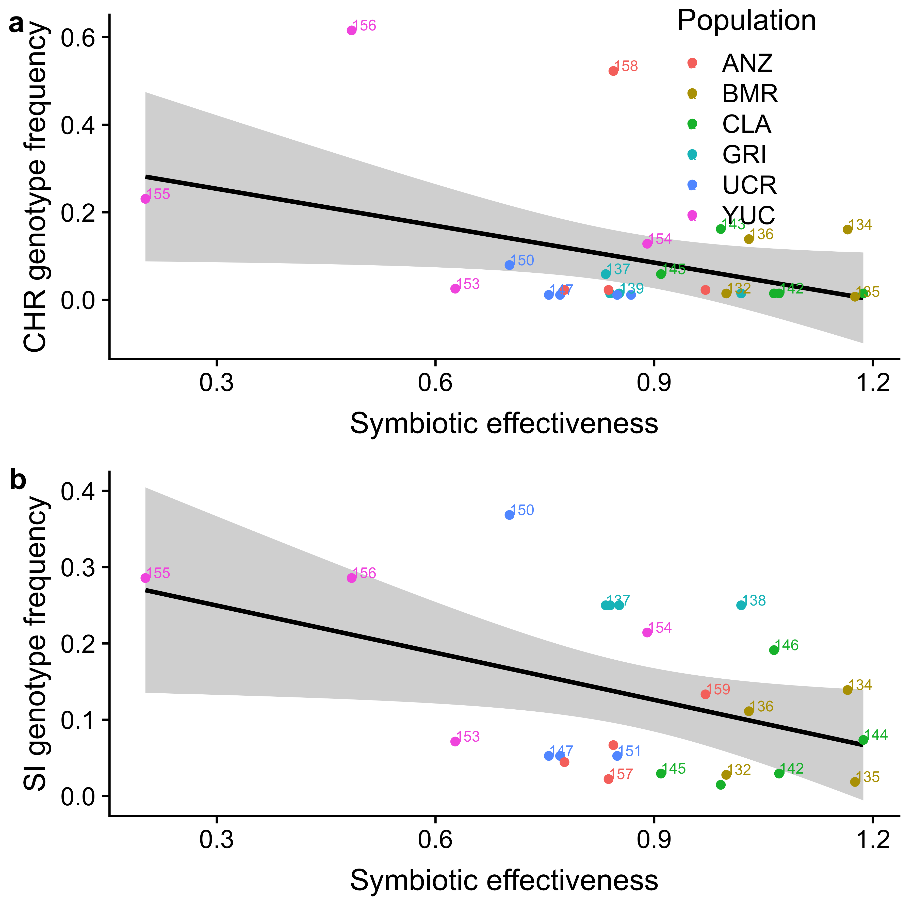

Are rhizobia under selection to cheat?
================
Megan Frederickson
2019-04-21

Is there fitness conflict between legumes and rhizobia?
-------------------------------------------------------

This repository re-analyzes the data in:

Gano-Cohen KA, Wendlandt CE, Stokes PJ, Blanton MA, Quides KW, Zomorrodian A, Adinata ES, Sachs JL (2019) Interspecific conflict and the evolution of ineffective rhizobia. Ecology Letters. <https://doi.org/10.1111/ele.13247>

The authors make the case that in their legume-rhizobium study system, the rhizobia are selected to cheat. In other words, they report a negative correlation between legume and rhizobium fitnesses.

Here, I re-analyze their data to explore how rhizobia were sampled across populations and how rhizobium fitness was measured in nature.

I downloaded the data from Dryad on April 16, 2019. The citation for the data package is:

Gano-Cohen KA, Wendlandt CE, Stokes PJ, Blanton MA, Quides KW, Zomorrodian A, Adinata ES, Sachs JL (2019) Data from: Interspecific conflict and the evolution of ineffective rhizobia. Dryad Digital Repository. <https://doi.org/10.5061/dryad.cr65269>

First we need to read in the data, which is in three different tables in the Dryad package.

``` r
table_S4 <- read_csv("Table_S4.csv", col_types = cols(Strain = col_factor(levels = c("132", "133", "134", "135", "136", "137", "138", "139", "140", "141", "142", "143", "144", "145", "146", "147", "148", "149", "150", "151", "152", "153", "154", "155", "156", "157", "158", "159", "160", "161", "control")), `Host Line` = col_factor(levels = c("BMR01.03", "BMR07.03", "UnH: Cla12.04", "UnL: Anz13.04", "A. heermannii", "Gri01.01", "Gri01.13", "Cla10.01", "Cla01.04", "UCR02.07", "UCR09.05", "Yuc02.07", "Yuc02.01", "Anz11.01", "Anz10.01")), Block = col_factor(levels = c("1", "2", "3", "4", "5")), `CHR local abundance` = col_number(), `Mean individual  nodule biomass (mg)` = col_number(), `Mineral N (ppm)` = col_number(), `Plant #` = col_number(), Population = col_factor(levels = c("ANZ",  "BMR", "CLA", "GRI", "UCR", "YUC")), `Relative Growth` = col_number(), `Roots mass (g)` = col_number(), `Shoots mass (g)` = col_number(), `Total N (%)` = col_number(), `Total nodules` = col_number()))
table_S4 <- subset(table_S4, `Shoots mass (g)` != "DEAD") #Exclude dead plants
table_S4 <- subset(table_S4, Strain != "control") #Exclude inoculated controls
  
table_S1 <- read_csv("Table_S1.csv", col_names = c("Full_Strain_Name", "Year", "Population", "glnII_Haplotype", "recA_Haplotype", "nodZ_Haplotype",  "nolL_Haplotype"), col_types = cols(Year = col_number(), Population = col_factor(levels = c("ANZ",  "BMR", "CLA", "GRI", "UCR", "YUC"))), skip = 1)

table_S2 <- read_csv("Table_S2.csv", col_names = c("Strain", "Full_Strain_Name", "Population", "Latitude", "Longitude", "glnII_Haplotype", "glnII_Accession", "recA_Haplotype", "recA_Accession", "nodZ_Haplotype", "nodZ_Accession", "nolL_Haplotype", "nolL_Accession", "CHR_Haplotype", "CHR genotype frequency" , "SI_haplotye", "SI genotype frequency"), col_types = cols(Strain = col_factor(levels = c("132", "133", "134", "135", "136", "137", "138", "139", "140", "141", "142", "143", "144", "145", "146", "147", "148", "149", "150", "151", "152", "153", "154", "155", "156", "157", "158", "159", "160", "161")), `CHR genotype frequency` = col_number(), `SI genotype frequency` = col_number(), Population = col_factor(levels = c("Bodega Marine Reserve", "Griffith Park", "Robert J. Bernard Biological Field Station", "University of California Riverside", "Burns Pinon Ridge Reserve", "Anza Borrego Desert State Park"))), skip = 2)
```

Next, we need to wrangle the data into a single dataframe.

``` r
table_S1$SI_haplotype <- paste0(table_S1$nodZ_Haplotype, "_", table_S1$nolL_Haplotype) #Concatenate SI haplotypes, as per paper
table_S1$CHR_haplotype <- paste0(table_S1$glnII_Haplotype, "_", table_S1$recA_Haplotype) #Concatenate CHR haplotypes, as per paper

table_S2$Population <- ifelse(table_S2$Population == "Bodega Marine Reserve", "BMR", ifelse(table_S2$Population == "Griffith Park", "GRI", ifelse(table_S2$Population == "Robert J. Bernard Biological Field Station", "CLA", ifelse(table_S2$Population == "University of California Riverside", "UCR", ifelse(table_S2$Population == "Anza Borrego Desert State Park", "ANZ", "YUC"))))) #Abbreviate Table_S2 population names

table_S1$Plant_ID <- gsub('R.*', "", (toupper(gsub('_.*', "", table_S1$Full_Strain_Name)))) #Make a column of unique plant ids

table_S1 <- table_S1[,c(1, 10, 2:9)] #Reorder columns
table_S1.long <- gather(table_S1, locus, haplotype, glnII_Haplotype:CHR_haplotype, factor_key=TRUE) #Make wide data into long format
table_S1.long <- subset(subset(table_S1.long, haplotype != "n/an/a"), haplotype != "n/a_n/a")  #Remove NAs
table_S1.long <- subset(table_S1.long, locus == "SI_haplotype" | locus == "CHR_haplotype") #Subset to just CHR and SI haplotypes

#Calculate nodules and plants sampled per population
new.table <- table_S1.long %>% group_by(Population, locus) %>% summarize(total_nods_sampled=n(), total_plants_sampled=length(unique(Plant_ID)))
new.table.long <- merge(subset(new.table, locus == "SI_haplotype"), subset(new.table, locus == "CHR_haplotype"), by="Population") #Make wide data long
new.table.long <- new.table.long[, c(1,3,4,6,7)]
colnames(new.table.long) <- c("Population", "SI_nods_sampled", "SI_plants_sampled", "CHR_nods_sampled", "CHR_plants_sampled")

#Merge number of nodules and plants sampled with Table S2 data
table_S2 <- merge(table_S2, new.table.long, by="Population", all.x = TRUE)

#Calculate strain means in Table S4
#These should really be predicted from a linear mixed model using the emmeans package
#But I think the original paper just used raw averages, so I do so here too
#Also, because the paper calculated strain means just on sympatric host lines, I do the same here
new.table2 <- subset(table_S4, `Host Line` != "A. heermannii" & `Host Line` != "UnH: Cla12.04" & `Host Line` != "UnL: Anz13.04") %>% group_by(Population, Strain) %>% summarize(mean_RGR = mean(`Relative Growth`, na.rm=TRUE), mean_total_nodules = mean(`Total nodules`, na.rm=TRUE), mean_nodule_mass = mean(`Mean individual  nodule biomass (mg)`, na.rm=TRUE))

#Merge data in Tables S2 and S4 into a single data frame
df <- merge(table_S2, new.table2[ ,2:5], by="Strain")
```

How many nodules and plants were sampled per site?
--------------------------------------------------

The sampling is uneven, with few plants sampled in ANZ and YUC.

``` r
colnames(new.table) <- c("Population", "Locus", "Nodules sampled (no.)", "Plants sampled (no.)")
new.table$Locus <- gsub("_haplotype", "", new.table$Locus)
kable(new.table)
```

| Population | Locus |  Nodules sampled (no.)|  Plants sampled (no.)|
|:-----------|:------|----------------------:|---------------------:|
| ANZ        | SI    |                     43|                     4|
| ANZ        | CHR   |                     44|                     4|
| BMR        | SI    |                    108|                    16|
| BMR        | CHR   |                    137|                    16|
| CLA        | SI    |                     68|                    20|
| CLA        | CHR   |                     68|                    20|
| GRI        | SI    |                      4|                     4|
| GRI        | CHR   |                     68|                    18|
| UCR        | SI    |                     17|                     5|
| UCR        | CHR   |                     88|                    31|
| YUC        | SI    |                     15|                     2|
| YUC        | CHR   |                     39|                     7|

Plot sampling of CHR and SI frequencies
---------------------------------------

``` r
#Model relationship between CHR frequency and number of plants sampled
model1 <- lm(`CHR genotype frequency`~CHR_plants_sampled, data=df)
summary(model1)
```

    ## 
    ## Call:
    ## lm(formula = `CHR genotype frequency` ~ CHR_plants_sampled, data = df)
    ## 
    ## Residuals:
    ##      Min       1Q   Median       3Q      Max 
    ## -0.15864 -0.06893 -0.02852  0.03546  0.45500 
    ## 
    ## Coefficients:
    ##                     Estimate Std. Error t value Pr(>|t|)   
    ## (Intercept)         0.209254   0.058857   3.555  0.00161 **
    ## CHR_plants_sampled -0.006979   0.003098  -2.253  0.03368 * 
    ## ---
    ## Signif. codes:  0 '***' 0.001 '**' 0.01 '*' 0.05 '.' 0.1 ' ' 1
    ## 
    ## Residual standard error: 0.1422 on 24 degrees of freedom
    ##   (4 observations deleted due to missingness)
    ## Multiple R-squared:  0.1746, Adjusted R-squared:  0.1402 
    ## F-statistic: 5.075 on 1 and 24 DF,  p-value: 0.03368

``` r
CHR <- ggplot(data=df, aes(y=`CHR genotype frequency`, x=CHR_plants_sampled, color=Population))+geom_point()+ geom_smooth(method="lm", se=FALSE, color=1)+xlab("Plants sampled (no.)")+ylab("CHR genotype frequency")+geom_text(aes(label=Strain),hjust=0, vjust=0, size=2.5, nudge_x = 0.05, check_overlap=TRUE)

#Model relationship between SI frequency and number of plants sampled
model2 <- lm(`SI genotype frequency`~SI_plants_sampled, data=df)
summary(model2)
```

    ## 
    ## Call:
    ## lm(formula = `SI genotype frequency` ~ SI_plants_sampled, data = df)
    ## 
    ## Residuals:
    ##      Min       1Q   Median       3Q      Max 
    ## -0.14266 -0.09816 -0.02745  0.08514  0.21029 
    ## 
    ## Coefficients:
    ##                    Estimate Std. Error t value Pr(>|t|)    
    ## (Intercept)        0.191858   0.031538   6.083 3.32e-06 ***
    ## SI_plants_sampled -0.006750   0.002758  -2.447   0.0225 *  
    ## ---
    ## Signif. codes:  0 '***' 0.001 '**' 0.01 '*' 0.05 '.' 0.1 ' ' 1
    ## 
    ## Residual standard error: 0.09795 on 23 degrees of freedom
    ##   (5 observations deleted due to missingness)
    ## Multiple R-squared:  0.2066, Adjusted R-squared:  0.1721 
    ## F-statistic: 5.988 on 1 and 23 DF,  p-value: 0.02246

``` r
SI <- ggplot(data=df, aes(y=`SI genotype frequency`, x=SI_plants_sampled, color=Population)) +geom_smooth(method="lm", se=FALSE, color=1)+geom_point()+xlab("Plants sampled (no.)")+ylab("SI genotype frequency")+geom_text(aes(label=Strain),hjust=0, vjust=0, size=2.5, nudge_x = 0.05, check_overlap=TRUE)

fig1 <- plot_grid(CHR, SI, nrow=2, labels="auto")
save_plot("Fig1.png", fig1, base_width=8, base_height=8)
fig1
```


Re-create original Fig. 5 from paper
------------------------------------

``` r
model3 <- lm(`CHR genotype frequency`~log10(mean_RGR), data=df)
summary(model3) #Numbers don't match paper, but qualitative pattern is the same
```

    ## 
    ## Call:
    ## lm(formula = `CHR genotype frequency` ~ log10(mean_RGR), data = df)
    ## 
    ## Residuals:
    ##      Min       1Q   Median       3Q      Max 
    ## -0.13050 -0.07016 -0.03656  0.00379  0.41804 
    ## 
    ## Coefficients:
    ##                 Estimate Std. Error t value Pr(>|t|)   
    ## (Intercept)       0.8521     0.2939   2.899  0.00788 **
    ## log10(mean_RGR)  -0.2622     0.1010  -2.595  0.01587 * 
    ## ---
    ## Signif. codes:  0 '***' 0.001 '**' 0.01 '*' 0.05 '.' 0.1 ' ' 1
    ## 
    ## Residual standard error: 0.1383 on 24 degrees of freedom
    ##   (4 observations deleted due to missingness)
    ## Multiple R-squared:  0.2192, Adjusted R-squared:  0.1866 
    ## F-statistic: 6.736 on 1 and 24 DF,  p-value: 0.01587

``` r
orig.fig5.CHR <- ggplot(data=df, aes(y=`CHR genotype frequency`, x=mean_RGR, color=Population))+geom_smooth(method="lm", se=FALSE, color=1)+geom_point()+xlab("Symbiotic effectiveness")+ylab("CHR genotype frequency")+scale_x_log10()+geom_text(aes(label=Strain),hjust=0, vjust=0, size=2.5, nudge_x = 0.05, check_overlap=TRUE)

model4 <- lm(`SI genotype frequency`~log10(mean_RGR), data=df)
summary(model4) #Numbers don't match paper, but qualitative pattern is the same
```

    ## 
    ## Call:
    ## lm(formula = `SI genotype frequency` ~ log10(mean_RGR), data = df)
    ## 
    ## Residuals:
    ##      Min       1Q   Median       3Q      Max 
    ## -0.10687 -0.08085 -0.01656  0.07767  0.24174 
    ## 
    ## Coefficients:
    ##                 Estimate Std. Error t value Pr(>|t|)   
    ## (Intercept)      0.61423    0.21076   2.914  0.00781 **
    ## log10(mean_RGR) -0.16664    0.07241  -2.301  0.03078 * 
    ## ---
    ## Signif. codes:  0 '***' 0.001 '**' 0.01 '*' 0.05 '.' 0.1 ' ' 1
    ## 
    ## Residual standard error: 0.09914 on 23 degrees of freedom
    ##   (5 observations deleted due to missingness)
    ## Multiple R-squared:  0.1872, Adjusted R-squared:  0.1518 
    ## F-statistic: 5.296 on 1 and 23 DF,  p-value: 0.03078

``` r
orig.fig5.SI <- ggplot(data=df, aes(y=`SI genotype frequency`, x=mean_RGR, color=Population)) +geom_smooth(method="lm", se=FALSE, color=1)+geom_point()+xlab("Symbiotic effectiveness")+ylab("SI genotype frequency")+scale_x_log10()+ geom_text(aes(label=Strain),hjust=0, vjust=0, size=2.5, nudge_x = 0.05, check_overlap=TRUE)

orig.fig5 <-plot_grid(orig.fig5.CHR, orig.fig5.SI, nrow=2, labels="auto")
orig.fig5
```



Relative fitness within populations
-----------------------------------

Ideally, to compare across studies, fitness measures, and traits, we should calculate selection gradients in the standard way, as we would for any continuous phenotype. Normally, fitness is relativized by dividing by population mean fitness, and traits are standardized by subtracting the mean and dividing by the standard deviation. This allows comparisons of the strength of selection across analyses because everything is on a common scale.

Here, I first use the same strain means for relative growth as above, but also then standardize them by substracting the mean and dividing by the SD. Either way, the relationship between genotype frequency and symbiotic effectiveness is non-significant once fitness is relativized within each population.

``` r
#Calculate mean fitness for each population
tmp <- df %>% group_by(Population) %>% summarize(pop_mean_CHR=mean(as.numeric(`CHR genotype frequency`), na.rm=TRUE), pop_mean_SI=mean(as.numeric(`SI genotype frequency`), na.rm=TRUE))
df <- merge(df, tmp, by="Population") #Merge data frames
df$CHR_std <- as.numeric(df$`CHR genotype frequency`)/df$pop_mean_CHR #Relative fitness within each population
df$SI_std <- as.numeric(df$`SI genotype frequency`)/df$pop_mean_SI #Relative fitness within each population
df$RGR_std <- (df$mean_RGR - mean(df$mean_RGR, na.rm=TRUE))/sd(df$mean_RGR, na.rm=TRUE) #Standardize trait by subtracting the mean and dividing by the standard deviation

#Relativized CHR and unstandardized RGR
model5 <- lm(CHR_std~log10(mean_RGR), data=df)
summary(model5)
```

    ## 
    ## Call:
    ## lm(formula = CHR_std ~ log10(mean_RGR), data = df)
    ## 
    ## Residuals:
    ##     Min      1Q  Median      3Q     Max 
    ## -0.9996 -0.6370 -0.5284  0.6344  2.5159 
    ## 
    ## Coefficients:
    ##                 Estimate Std. Error t value Pr(>|t|)
    ## (Intercept)       2.4375     2.3070   1.057    0.301
    ## log10(mean_RGR)  -0.4961     0.7928  -0.626    0.537
    ## 
    ## Residual standard error: 1.086 on 24 degrees of freedom
    ##   (4 observations deleted due to missingness)
    ## Multiple R-squared:  0.01605,    Adjusted R-squared:  -0.02494 
    ## F-statistic: 0.3916 on 1 and 24 DF,  p-value: 0.5374

``` r
#Relativized CHR and standardized RGR
model6 <- lm(CHR_std~RGR_std, data=df)
summary(model6)
```

    ## 
    ## Call:
    ## lm(formula = CHR_std ~ RGR_std, data = df)
    ## 
    ## Residuals:
    ##     Min      1Q  Median      3Q     Max 
    ## -1.0726 -0.6060 -0.5235  0.6423  2.4570 
    ## 
    ## Coefficients:
    ##             Estimate Std. Error t value Pr(>|t|)    
    ## (Intercept)   1.0000     0.2121   4.714 8.59e-05 ***
    ## RGR_std      -0.1625     0.2163  -0.751     0.46    
    ## ---
    ## Signif. codes:  0 '***' 0.001 '**' 0.01 '*' 0.05 '.' 0.1 ' ' 1
    ## 
    ## Residual standard error: 1.082 on 24 degrees of freedom
    ##   (4 observations deleted due to missingness)
    ## Multiple R-squared:  0.02298,    Adjusted R-squared:  -0.01773 
    ## F-statistic: 0.5644 on 1 and 24 DF,  p-value: 0.4598

``` r
#Relativized SI and unstandardized RGR
model7 <- lm(SI_std~log10(mean_RGR), data=df) 
summary(model7)
```

    ## 
    ## Call:
    ## lm(formula = SI_std ~ log10(mean_RGR), data = df)
    ## 
    ## Residuals:
    ##      Min       1Q   Median       3Q      Max 
    ## -0.77370 -0.60118 -0.00309  0.24879  1.84127 
    ## 
    ## Coefficients:
    ##                 Estimate Std. Error t value Pr(>|t|)
    ## (Intercept)      1.23889    1.60415   0.772    0.448
    ## log10(mean_RGR) -0.08244    0.55115  -0.150    0.882
    ## 
    ## Residual standard error: 0.7546 on 23 degrees of freedom
    ##   (5 observations deleted due to missingness)
    ## Multiple R-squared:  0.0009718,  Adjusted R-squared:  -0.04246 
    ## F-statistic: 0.02237 on 1 and 23 DF,  p-value: 0.8824

``` r
#Relativized SI and standardized RGR
model8 <- lm(SI_std~RGR_std, data=df) 
summary(model8)
```

    ## 
    ## Call:
    ## lm(formula = SI_std ~ RGR_std, data = df)
    ## 
    ## Residuals:
    ##      Min       1Q   Median       3Q      Max 
    ## -0.79938 -0.59222  0.00443  0.37217  1.81066 
    ## 
    ## Coefficients:
    ##             Estimate Std. Error t value Pr(>|t|)    
    ## (Intercept)  0.99973    0.15094   6.623 9.31e-07 ***
    ## RGR_std      0.02181    0.15124   0.144    0.887    
    ## ---
    ## Signif. codes:  0 '***' 0.001 '**' 0.01 '*' 0.05 '.' 0.1 ' ' 1
    ## 
    ## Residual standard error: 0.7547 on 23 degrees of freedom
    ##   (5 observations deleted due to missingness)
    ## Multiple R-squared:  0.000903,   Adjusted R-squared:  -0.04254 
    ## F-statistic: 0.02079 on 1 and 23 DF,  p-value: 0.8866

``` r
new.Fig5.SI.unstandardized <- ggplot(data=df, aes(y=SI_std, x=mean_RGR, color=Population))+geom_point()+geom_smooth(method="lm", se=FALSE, linetype="dashed", color=1)+geom_text(aes(label=Strain),hjust=0, vjust=0, size=3)+ ylab("SI genotype frequency")+  xlab("Symbiotic effectiveness")+scale_x_log10()

new.Fig5.CHR.unstandardized <- ggplot(data=df, aes(y=CHR_std, x=mean_RGR, color=Population))+ geom_point()+geom_smooth(method="lm", se=FALSE, linetype="dashed", color=1)+geom_text(aes(label=Strain),hjust=0, vjust=0, size=3)+ylab("CHR genotype frequency")+xlab("Symbiotic effectiveness")+scale_x_log10()

new.Fig5 <- plot_grid(new.Fig5.CHR.unstandardized, new.Fig5.SI.unstandardized, nrow=2, labels="auto")
new.Fig5
```


Test for outliers
-----------------

``` r
dixon.test(as.numeric(df$`CHR genotype frequency`)) #Test for outliers in CHR genotype frequency 
```

    ## 
    ##  Dixon test for outliers
    ## 
    ## data:  as.numeric(df$`CHR genotype frequency`)
    ## Q = 0.63675, p-value < 2.2e-16
    ## alternative hypothesis: highest value 0.6154 is an outlier

``` r
#Exclude strain 156, which is a significant outlier for CHR genotype frequency and the same SI haplotype as 155

model9 <- lm(`CHR genotype frequency`~log10(mean_RGR), data=subset(df, Strain != "156"))
summary(model9) #Non-significant
```

    ## 
    ## Call:
    ## lm(formula = `CHR genotype frequency` ~ log10(mean_RGR), data = subset(df, 
    ##     Strain != "156"))
    ## 
    ## Residuals:
    ##      Min       1Q   Median       3Q      Max 
    ## -0.08422 -0.05419 -0.03724  0.00881  0.44253 
    ## 
    ## Coefficients:
    ##                 Estimate Std. Error t value Pr(>|t|)  
    ## (Intercept)      0.44108    0.25686   1.717   0.0994 .
    ## log10(mean_RGR) -0.12659    0.08767  -1.444   0.1623  
    ## ---
    ## Signif. codes:  0 '***' 0.001 '**' 0.01 '*' 0.05 '.' 0.1 ' ' 1
    ## 
    ## Residual standard error: 0.11 on 23 degrees of freedom
    ##   (4 observations deleted due to missingness)
    ## Multiple R-squared:  0.08311,    Adjusted R-squared:  0.04324 
    ## F-statistic: 2.085 on 1 and 23 DF,  p-value: 0.1623

``` r
model10 <- lm(`SI genotype frequency`~log10(mean_RGR), data=subset(df, Strain != "156"))
summary(model10) #Non-significant
```

    ## 
    ## Call:
    ## lm(formula = `SI genotype frequency` ~ log10(mean_RGR), data = subset(df, 
    ##     Strain != "156"))
    ## 
    ## Residuals:
    ##      Min       1Q   Median       3Q      Max 
    ## -0.09977 -0.07794 -0.03679  0.08330  0.24430 
    ## 
    ## Coefficients:
    ##                 Estimate Std. Error t value Pr(>|t|)  
    ## (Intercept)      0.54425    0.23412   2.325   0.0297 *
    ## log10(mean_RGR) -0.14360    0.07987  -1.798   0.0859 .
    ## ---
    ## Signif. codes:  0 '***' 0.001 '**' 0.01 '*' 0.05 '.' 0.1 ' ' 1
    ## 
    ## Residual standard error: 0.1002 on 22 degrees of freedom
    ##   (5 observations deleted due to missingness)
    ## Multiple R-squared:  0.1281, Adjusted R-squared:  0.08847 
    ## F-statistic: 3.232 on 1 and 22 DF,  p-value: 0.08594
