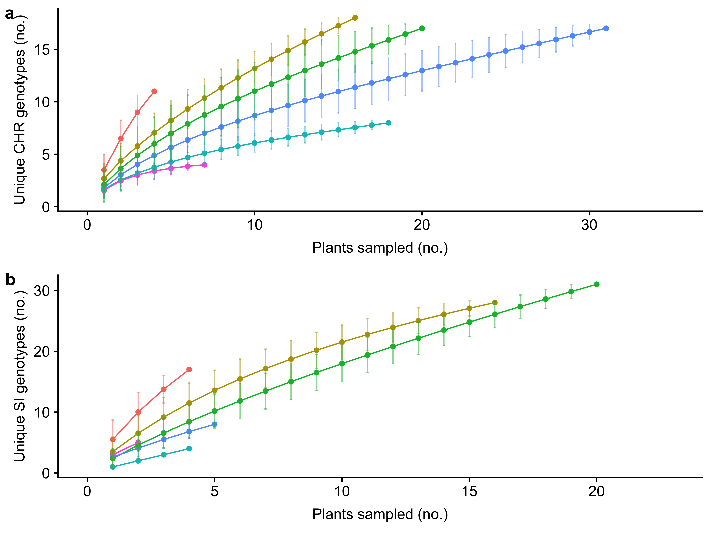
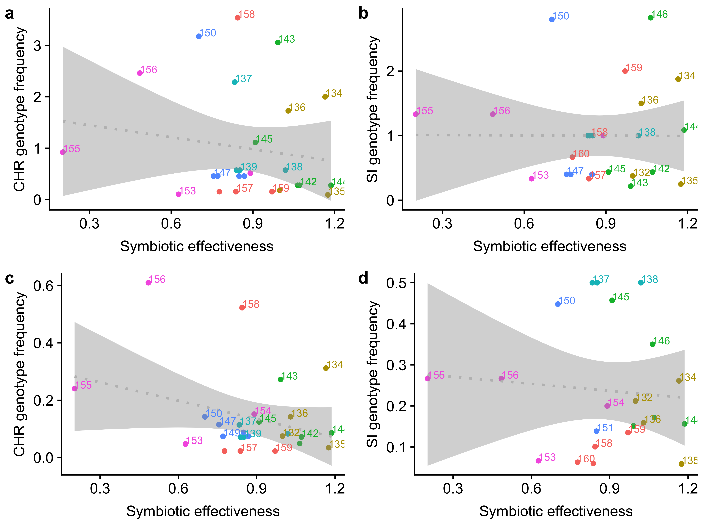

Are rhizobia under selection to cheat?
================
Megan Frederickson
2019-05-01

Is there fitness conflict between legumes and rhizobia?
-------------------------------------------------------

This repository re-analyzes the data in: Gano-Cohen KA, Wendlandt CE, Stokes PJ, Blanton MA, Quides KW, Zomorrodian A, Adinata ES, Sachs JL (2019) Interspecific conflict and the evolution of ineffective rhizobia. Ecology Letters. <https://doi.org/10.1111/ele.13247>

The authors make the case that in their legume-rhizobium study system, the rhizobia are selected to cheat. They base this conclusion on a negative correlation between legume and rhizobium fitnesses (their Figure 5).

Here, I re-analyze their data, mostly to explore how they measured rhizobium fitness.

I downloaded their data from Dryad on April 16, 2019. The citation for the data package is: Gano-Cohen KA, Wendlandt CE, Stokes PJ, Blanton MA, Quides KW, Zomorrodian A, Adinata ES, Sachs JL (2019) Data from: Interspecific conflict and the evolution of ineffective rhizobia. Dryad Digital Repository. <https://doi.org/10.5061/dryad.cr65269>

First we need to read in the data, which is in three different tables in the Dryad package.

``` r
table_S4 <- read_csv("Table_S4.csv", col_types = cols(Strain = col_factor(levels = c("132", "133", "134", "135", "136", "137", "138", "139", "140", "141", "142", "143", "144", "145", "146", "147", "148", "149", "150", "151", "152", "153", "154", "155", "156", "157", "158", "159", "160", "161", "control")), `Host Line` = col_factor(levels = c("BMR01.03", "BMR07.03", "UnH: Cla12.04", "UnL: Anz13.04", "A. heermannii", "Gri01.01", "Gri01.13", "Cla10.01", "Cla01.04", "UCR02.07", "UCR09.05", "Yuc02.07", "Yuc02.01", "Anz11.01", "Anz10.01")), Block = col_factor(levels = c("1", "2", "3", "4", "5")), `CHR local abundance` = col_number(), `Mean individual  nodule biomass (mg)` = col_number(), `Mineral N (ppm)` = col_number(), `Plant #` = col_number(), Population = col_factor(levels = c("ANZ",  "BMR", "CLA", "GRI", "UCR", "YUC")), `Relative Growth` = col_number(), `Roots mass (g)` = col_number(), `Shoots mass (g)` = col_number(), `Total N (%)` = col_number(), `Total nodules` = col_number()))
  
table_S1 <- read_csv("Table_S1.csv", col_names = c("Full_Strain_Name", "Year", "Population", "glnII_Haplotype", "recA_Haplotype", "nodZ_Haplotype",  "nolL_Haplotype"), col_types = cols(Year = col_number(), Population = col_factor(levels = c("ANZ",  "BMR", "CLA", "GRI", "UCR", "YUC"))), skip = 1)

table_S2 <- read_csv("Table_S2.csv", col_names = c("Strain", "Full_Strain_Name", "Population", "Latitude", "Longitude", "glnII_Haplotype", "glnII_Accession", "recA_Haplotype", "recA_Accession", "nodZ_Haplotype", "nodZ_Accession", "nolL_Haplotype", "nolL_Accession", "CHR_Haplotype", "CHR genotype frequency" , "SI_haplotye", "SI genotype frequency"), col_types = cols(Strain = col_factor(levels = c("132", "133", "134", "135", "136", "137", "138", "139", "140", "141", "142", "143", "144", "145", "146", "147", "148", "149", "150", "151", "152", "153", "154", "155", "156", "157", "158", "159", "160", "161")), `CHR genotype frequency` = col_number(), `SI genotype frequency` = col_number(), Population = col_factor(levels = c("Bodega Marine Reserve", "Griffith Park", "Robert J. Bernard Biological Field Station", "University of California Riverside", "Burns Pinon Ridge Reserve", "Anza Borrego Desert State Park"))), skip = 2)
```

Next, we need to clean up the data and wrangle it into a single dataframe.

``` r
#There is an issue with the "Relative Growth" column in the Dryad version of Table S4
#Values are hundreds or thousands, but inoculated plants did not grow 100-1000x more than controls
#In fact, the x-axis of Figure 5 in the original paper shows values from ~0.5-1.2 on a log scale
#So real values should be on the order of ~1-100x
#As a result, I recalculated Relative Growth Rate (RGR) from scratch
#I followed the methods described in the original paper, attempting to match the original analysis
table_S4$pop_block <- paste0(table_S4$Block, table_S4$`Host Line`) #Make a unique identifier for each block-host line combination
table_S4$Plant_biomass <- table_S4$`Shoots mass (g)`+table_S4$`Roots mass (g)` #Sum root and shoot mass
tmp <- subset(table_S4, Strain == "control") #Subset control plants only
table_S4 <- merge(table_S4, tmp[, c(1, 17, 18)], by="pop_block") #Match inoculated plants to controls based on which block and host line they were

#The footnotes for Table 1 in the original paper says when controls were substituted, so I follow suit here
table_S4[table_S4$`Plant #.y` == 111, 20] <- table_S4[table_S4$`Plant #.y` == 106, 20] #Sub 106 for 111
table_S4[table_S4$`Plant #.y` == 222, 20] <- table_S4[table_S4$`Plant #.y` == 216, 20] #Sub 216 for 222
table_S4[table_S4$`Plant #.y` == 669, 20] <- mean(c(unique(table_S4[table_S4$`Plant #.y` == 651, 20]), unique(table_S4[table_S4$`Plant #.y` == 660, 20]), unique(table_S4[table_S4$`Plant #.y` == 663, 20]), unique(table_S4[table_S4$`Plant #.y` == 680, 20]), unique(table_S4[table_S4$`Plant #.y` == 684, 20]))) #Sub mean of 651, 660, 663, 680, and 684 for 669

table_S4 <- subset(table_S4, `Shoots mass (g)` != "DEAD") #Exclude dead plants, as per paper
table_S4 <- subset(table_S4, Strain != "control") #Exclude uninoculated controls, as per paper
table_S4 <- subset(table_S4, `Total nodules` > 0) #Exclude inoculated plants that formed no nodules, as per paper
table_S4$RGR <- table_S4$Plant_biomass.x/table_S4$Plant_biomass.y #Re-calculate RGR (values look better)
table_S4$logRGR <- log10(table_S4$RGR) #Log-transform RGR, as per paper

table_S1$SI_haplotype <- paste0(table_S1$nodZ_Haplotype, "_", table_S1$nolL_Haplotype) #Concatenate SI haplotypes, as per paper
table_S1$CHR_haplotype <- paste0(table_S1$glnII_Haplotype, "_", table_S1$recA_Haplotype) #Concatenate CHR haplotypes, as per paper

table_S2$Population <- ifelse(table_S2$Population == "Bodega Marine Reserve", "BMR", ifelse(table_S2$Population == "Griffith Park", "GRI", ifelse(table_S2$Population == "Robert J. Bernard Biological Field Station", "CLA", ifelse(table_S2$Population == "University of California Riverside", "UCR", ifelse(table_S2$Population == "Anza Borrego Desert State Park", "ANZ", "YUC"))))) #Abbreviate Table_S2 population names, to make them match across data tables

table_S1$Plant_ID <- gsub('R.*', "", (toupper(gsub('_.*', "", table_S1$Full_Strain_Name)))) #Make a column of unique plant ids

table_S1 <- table_S1[,c(1, 10, 2:9)] #Reorder columns
table_S1.long <- gather(table_S1, locus, haplotype, glnII_Haplotype:CHR_haplotype, factor_key=TRUE) #Make wide data into long format
table_S1.long <- subset(subset(table_S1.long, haplotype != "n/an/a"), haplotype != "n/a_n/a")  #Remove NAs
table_S1.long <- subset(table_S1.long, locus == "SI_haplotype" | locus == "CHR_haplotype") #Subset to just CHR and SI haplotypes

#Calculate nodules and plants sampled per population
new.table <- table_S1.long %>% group_by(Population, locus) %>% summarize(total_nods_sampled=n(), total_plants_sampled=length(unique(Plant_ID))) #Summarize data by locus and population
new.table.long <- merge(subset(new.table, locus == "SI_haplotype"), subset(new.table, locus == "CHR_haplotype"), by="Population") #Make wide data long
new.table.long <- new.table.long[, c(1,3,4,6,7)]
colnames(new.table.long) <- c("Population", "SI_nods_sampled", "SI_plants_sampled", "CHR_nods_sampled", "CHR_plants_sampled")

#Merge number of nodules and plants sampled with Table S2 data
table_S2 <- merge(table_S2, new.table.long, by="Population", all.x = TRUE) #Add sampling effort to Table 2

#Calculate strain means in Table S4
#These should really be predicted from a linear mixed model using something like the emmeans package
#But the original paper says they just used raw averages, so I do so here too
#Also, because the paper calculated strain means just on sympatric host lines, I do the same here
data_sym <- subset(table_S4, `Host Line` != "A. heermannii" & `Host Line` != "UnH: Cla12.04" & `Host Line` != "UnL: Anz13.04")
new.table2 <- data_sym %>% group_by(Population, Strain) %>% summarize(mean_RGR = mean(`Relative Growth`, na.rm=TRUE), mean_total_nodules = mean(`Total nodules`, na.rm=TRUE), mean_nodule_mass = mean(`Mean individual  nodule biomass (mg)`, na.rm=TRUE), mean_log10_RGR = mean(logRGR, na.rm=TRUE)) #Calculate means

#Merge data in Tables S2 and S4 into a single data frame
df <- merge(table_S2, new.table2[ ,2:6], by="Strain") 
```

How many nodules and plants were sampled per site?
--------------------------------------------------

``` r
colnames(new.table) <- c("Population", "Locus", "Nodules sampled (no.)", "Plants sampled (no.)")
new.table$Locus <- gsub("_haplotype", "", new.table$Locus)
kable(new.table)
```

| Population | Locus |  Nodules sampled (no.)|  Plants sampled (no.)|
|:-----------|:------|----------------------:|---------------------:|
| ANZ        | SI    |                     43|                     4|
| ANZ        | CHR   |                     44|                     4|
| BMR        | SI    |                    108|                    16|
| BMR        | CHR   |                    137|                    16|
| CLA        | SI    |                     68|                    20|
| CLA        | CHR   |                     68|                    20|
| GRI        | SI    |                      4|                     4|
| GRI        | CHR   |                     68|                    18|
| UCR        | SI    |                     17|                     5|
| UCR        | CHR   |                     88|                    31|
| YUC        | SI    |                     15|                     2|
| YUC        | CHR   |                     39|                     7|

The sampling is very uneven, with few plants sampled in ANZ and YUC. SI genotype frequencies are calculated from just 2 plants at YUC, and CHR genotype frequencies are calculated from just 4 plants at ANZ and 7 plants at YUC.

Plot sampling of CHR and SI frequencies
---------------------------------------

Does this uneven sampling matter? Here, I plot the relationship between genotype frequency at a site and sampling effort (i.e., the number of plants sampled). I also use simple linear models to ask whether genotype frequencies are related to sampling effort.

``` r
#Model relationship between CHR frequency and number of plants sampled
model1 <- lm(`CHR genotype frequency`~CHR_plants_sampled, data=df)
summary(model1) #Significant correlation 
```

    ## 
    ## Call:
    ## lm(formula = `CHR genotype frequency` ~ CHR_plants_sampled, data = df)
    ## 
    ## Residuals:
    ##      Min       1Q   Median       3Q      Max 
    ## -0.15864 -0.06893 -0.02852  0.03546  0.45500 
    ## 
    ## Coefficients:
    ##                     Estimate Std. Error t value Pr(>|t|)   
    ## (Intercept)         0.209254   0.058857   3.555  0.00161 **
    ## CHR_plants_sampled -0.006979   0.003098  -2.253  0.03368 * 
    ## ---
    ## Signif. codes:  0 '***' 0.001 '**' 0.01 '*' 0.05 '.' 0.1 ' ' 1
    ## 
    ## Residual standard error: 0.1422 on 24 degrees of freedom
    ## Multiple R-squared:  0.1746, Adjusted R-squared:  0.1402 
    ## F-statistic: 5.075 on 1 and 24 DF,  p-value: 0.03368

``` r
#Model relationship between SI frequency and number of plants sampled
model2 <- lm(`SI genotype frequency`~SI_plants_sampled, data=df)
summary(model2) #Significant correlation
```

    ## 
    ## Call:
    ## lm(formula = `SI genotype frequency` ~ SI_plants_sampled, data = df)
    ## 
    ## Residuals:
    ##      Min       1Q   Median       3Q      Max 
    ## -0.14266 -0.09816 -0.02745  0.08514  0.21029 
    ## 
    ## Coefficients:
    ##                    Estimate Std. Error t value Pr(>|t|)    
    ## (Intercept)        0.191858   0.031538   6.083 3.32e-06 ***
    ## SI_plants_sampled -0.006750   0.002758  -2.447   0.0225 *  
    ## ---
    ## Signif. codes:  0 '***' 0.001 '**' 0.01 '*' 0.05 '.' 0.1 ' ' 1
    ## 
    ## Residual standard error: 0.09795 on 23 degrees of freedom
    ##   (1 observation deleted due to missingness)
    ## Multiple R-squared:  0.2066, Adjusted R-squared:  0.1721 
    ## F-statistic: 5.988 on 1 and 23 DF,  p-value: 0.02246

``` r
#Make figures
CHR <- ggplot(data=df, aes(y=`CHR genotype frequency`, x=CHR_plants_sampled, color=Population))+geom_point()+ geom_smooth(method="lm", se=TRUE, color=1)+xlab("Plants sampled (no.)")+ylab("CHR genotype frequency")+geom_text(aes(label=Strain),hjust=0, vjust=0, size=2.5, nudge_x = 0.05, check_overlap=TRUE)+scale_x_continuous(limits=c(0, 35))+theme(legend.position = c(0.7,0.7))

SI <- ggplot(data=df, aes(y=`SI genotype frequency`, x=SI_plants_sampled, color=Population)) +geom_smooth(method="lm", se=TRUE, color=1)+geom_point()+xlab("Plants sampled (no.)")+ylab("SI genotype frequency")+geom_text(aes(label=Strain),hjust=0, vjust=0, size=2.5, nudge_x = 0.05, check_overlap=TRUE)+scale_x_continuous(limits=c(0, 23))+guides(color=FALSE)

fig.plants <- plot_grid(CHR, SI, nrow=2, labels="auto") 
fig.plants #Show figure
```


Rarefaction analysis of haplotypes sampled at field sistes
----------------------------------------------------------

Here, I use standard methods from community ecology to explore whether rhizobia genotypes were adequately sampled at the six field sites.

``` r
library(vegan) #Load libaries with rarefaction functions
library(labdsv)

table_S1$pop_plant <- paste0(table_S1$Population, table_S1$Plant_ID) #Create unique population-plant identifier
  
#Transform Table S1 data into a community matrix, in which columns are SI or CHR haplotypes and rows are plants
SI_matrix <- table_S1[, c(9,11)] %>% group_by(pop_plant, SI_haplotype) %>% count(SI_haplotype)
SI_matrix <- subset(SI_matrix, SI_haplotype != "n/a_n/a") #Remove NAs
SI_matrix <- subset(SI_matrix, SI_haplotype != "Z01_X" & SI_haplotype != "Z13_X") #Remove Xs 
SI_matrix <- matrify(as.data.frame(SI_matrix))
CHR_matrix <- table_S1[, c(10,11)] %>% group_by(pop_plant, CHR_haplotype) %>% count(CHR_haplotype)
CHR_matrix <- subset(CHR_matrix, CHR_haplotype != "n/a_n/a") #Remove NAs
CHR_matrix <- matrify(as.data.frame(CHR_matrix))

#Rarefy within each population
SI.accum.CLA <- specaccum(SI_matrix[21:40, ])
SI.accum.BMR <- specaccum(SI_matrix[5:20, ])
SI.accum.ANZ <- specaccum(SI_matrix[1:4, ]) 
SI.accum.GRI <- specaccum(SI_matrix[41:44, ])
SI.accum.YUC <- specaccum(SI_matrix[50:51, ])
SI.accum.UCR <- specaccum(SI_matrix[45:49, ])
CHR.accum.CLA <- specaccum(CHR_matrix[21:40, ])
CHR.accum.BMR <- specaccum(CHR_matrix[5:20, ])
CHR.accum.ANZ <- specaccum(CHR_matrix[1:4, ]) 
CHR.accum.GRI <- specaccum(CHR_matrix[41:58, ])
CHR.accum.YUC <- specaccum(CHR_matrix[90:96, ])
CHR.accum.UCR <- specaccum(CHR_matrix[59:89, ])

#Wrangle in to a single dataframe
SI.accum <- rbind(data.frame(plants=SI.accum.YUC$sites, richness=SI.accum.YUC$richness, SD=SI.accum.YUC$sd, Population="YUC"), data.frame(plants=SI.accum.UCR$sites, richness=SI.accum.UCR$richness, SD=SI.accum.UCR$sd, Population="UCR"), data.frame(plants=SI.accum.GRI$sites, richness=SI.accum.GRI$richness, SD=SI.accum.GRI$sd, Population="GRI"), data.frame(plants=SI.accum.ANZ$sites, richness=SI.accum.ANZ$richness, SD=SI.accum.ANZ$sd, Population="ANZ"), data.frame(plants=SI.accum.BMR$sites, richness=SI.accum.BMR$richness, SD=SI.accum.BMR$sd, Population="BMR"), data.frame(plants=SI.accum.CLA$sites, richness=SI.accum.CLA$richness, SD=SI.accum.CLA$sd, Population="CLA"))
SI.accum$Population <- factor(SI.accum$Population, levels=c("ANZ", "BMR", "CLA", "GRI", "UCR", "YUC"))

CHR.accum <- rbind(data.frame(plants=CHR.accum.YUC$sites, richness=CHR.accum.YUC$richness, SD=CHR.accum.YUC$sd, Population="YUC"), data.frame(plants=CHR.accum.UCR$sites, richness=CHR.accum.UCR$richness, SD=CHR.accum.UCR$sd, Population="UCR"), data.frame(plants=CHR.accum.GRI$sites, richness=CHR.accum.GRI$richness, SD=CHR.accum.GRI$sd, Population="GRI"), data.frame(plants=CHR.accum.ANZ$sites, richness=CHR.accum.ANZ$richness, SD=CHR.accum.ANZ$sd, Population="ANZ"), data.frame(plants=CHR.accum.BMR$sites, richness=CHR.accum.BMR$richness, SD=CHR.accum.BMR$sd, Population="BMR"), data.frame(plants=CHR.accum.CLA$sites, richness=CHR.accum.CLA$richness, SD=CHR.accum.CLA$sd, Population="CLA"))
CHR.accum$Population <- factor(CHR.accum$Population, levels=c("ANZ", "BMR", "CLA", "GRI", "UCR", "YUC"))

#Plot 'genotype accumulation' curves
SI.accum.curve <- ggplot(data=SI.accum, aes(x=plants, y=richness, color=Population))+geom_point()+geom_line()+geom_errorbar(aes(x=plants, ymin=richness-SD, ymax=richness+SD), alpha=0.5, width=0.1)+xlab("Plants sampled (no.)")+ylab("Unique SI genotypes (no.)")+scale_x_continuous(limits=c(0, 23))+guides(color=FALSE)

CHR.accum.curve <- ggplot(data=CHR.accum, aes(x=plants, y=richness, color=Population))+geom_point()+geom_line()+geom_errorbar(aes(x=plants, ymin=richness-SD, ymax=richness+SD), alpha=0.5, width=0.1)+xlab("Plants sampled (no.)")+ylab("Unique CHR genotypes (no.)")+scale_x_continuous(limits=c(0, 35))+guides(color=FALSE)
 
#Combine with previous figures to make full figure for paper
fig1 <- plot_grid(CHR, SI, CHR.accum.curve, SI.accum.curve, nrow=2, ncol=2, labels="auto")
fig1
```



``` r
save_plot("Fig1.png", fig1, base_width=8, base_height=8)
```

How does uneven sampling among sites affect the results?
--------------------------------------------------------

I corrected for uneven sampling in two ways: 1) by relativizing fitness by dividing by the population mean, and 2) by sub-sampling the data for each population to the smallest sample sizes, and re-calculating genotype frequencies. Then I re-analyzed the relationship between strain frequency and symbiotic effectiveness (i.e., what appears in the original paper's Figure 5) using simple linear models.

Method 1: Relativize fitness within populations
-----------------------------------------------

First, I need to re-create the original analysis in the paper's Figure 5, to make sure I get the same answer.

``` r
#Model CHR genotype frequency, as in original paper
model3 <- lm(`CHR genotype frequency`~mean_log10_RGR, data=df)
summary(model3) #Numbers match paper!
```

    ## 
    ## Call:
    ## lm(formula = `CHR genotype frequency` ~ mean_log10_RGR, data = df)
    ## 
    ## Residuals:
    ##      Min       1Q   Median       3Q      Max 
    ## -0.13620 -0.08356 -0.04267  0.00759  0.42187 
    ## 
    ## Coefficients:
    ##                Estimate Std. Error t value Pr(>|t|)   
    ## (Intercept)      0.3380     0.1195   2.828   0.0093 **
    ## mean_log10_RGR  -0.2811     0.1330  -2.114   0.0451 * 
    ## ---
    ## Signif. codes:  0 '***' 0.001 '**' 0.01 '*' 0.05 '.' 0.1 ' ' 1
    ## 
    ## Residual standard error: 0.1437 on 24 degrees of freedom
    ## Multiple R-squared:  0.157,  Adjusted R-squared:  0.1218 
    ## F-statistic: 4.468 on 1 and 24 DF,  p-value: 0.04512

``` r
Anova(model3) #Numbers match paper!
```

    ## Anova Table (Type II tests)
    ## 
    ## Response: CHR genotype frequency
    ##                 Sum Sq Df F value  Pr(>F)  
    ## mean_log10_RGR 0.09228  1  4.4681 0.04512 *
    ## Residuals      0.49568 24                  
    ## ---
    ## Signif. codes:  0 '***' 0.001 '**' 0.01 '*' 0.05 '.' 0.1 ' ' 1

``` r
#Model SI genotype frequency, as in original paper
model4 <- lm(`SI genotype frequency`~mean_log10_RGR, data=df)
summary(model4) #Numbers match paper
```

    ## 
    ## Call:
    ## lm(formula = `SI genotype frequency` ~ mean_log10_RGR, data = df)
    ## 
    ## Residuals:
    ##      Min       1Q   Median       3Q      Max 
    ## -0.11670 -0.09247  0.00664  0.08633  0.20149 
    ## 
    ## Coefficients:
    ##                Estimate Std. Error t value Pr(>|t|)   
    ## (Intercept)     0.31151    0.08302   3.752  0.00104 **
    ## mean_log10_RGR -0.20612    0.09222  -2.235  0.03541 * 
    ## ---
    ## Signif. codes:  0 '***' 0.001 '**' 0.01 '*' 0.05 '.' 0.1 ' ' 1
    ## 
    ## Residual standard error: 0.09967 on 23 degrees of freedom
    ##   (1 observation deleted due to missingness)
    ## Multiple R-squared:  0.1784, Adjusted R-squared:  0.1427 
    ## F-statistic: 4.996 on 1 and 23 DF,  p-value: 0.03541

``` r
Anova(model4) #Numbers match paper
```

    ## Anova Table (Type II tests)
    ## 
    ## Response: SI genotype frequency
    ##                  Sum Sq Df F value  Pr(>F)  
    ## mean_log10_RGR 0.049632  1  4.9957 0.03541 *
    ## Residuals      0.228505 23                  
    ## ---
    ## Signif. codes:  0 '***' 0.001 '**' 0.01 '*' 0.05 '.' 0.1 ' ' 1

``` r
#Make my own version of the authors' Figure 5
orig.fig5.CHR <- ggplot(data=df, aes(y=`CHR genotype frequency`, x=mean_log10_RGR, color=Population))+geom_smooth(method="lm", color=1)+geom_point()+xlab("Symbiotic effectiveness")+ylab("CHR genotype frequency")+geom_text(aes(label=Strain),hjust=0, vjust=0, size=2.5, check_overlap=TRUE)+theme(legend.position = c(0.7, 0.7))

orig.fig5.SI <- ggplot(data=df, aes(y=`SI genotype frequency`, x=mean_log10_RGR, color=Population)) +geom_smooth(method="lm", color=1)+geom_point()+xlab("Symbiotic effectiveness")+ylab("SI genotype frequency")+ geom_text(aes(label=Strain),hjust=0, vjust=0, size=2.5,  check_overlap=TRUE)+guides(color=FALSE)

orig.fig5 <-plot_grid(orig.fig5.CHR, orig.fig5.SI, nrow=2, labels="auto")
orig.fig5 #Hmm ... very close, but not exactly the same
```


Relative fitness within populations
-----------------------------------

Ideally, to compare across studies, fitness measures, and traits, we should calculate selection gradients in the standard way, as we would for any continuous phenotype. Normally, fitness is relativized by dividing by population mean fitness, and traits are standardized by subtracting the mean and dividing by the standard deviation. This allows comparisons of the strength of selection across analyses because everything is on a common scale.

Here, I first relativize fitness within populations by dividing by population mean fitness (i.e., population mean strain frequency). Then I use the same strain means for relative growth as above in one analysis, and then also standardize strain means by substracting the mean and dividing by the SD in a second analysis. Either way, the relationship between genotype frequency and symbiotic effectiveness is non-significant (for both CHR and SI) once fitness is relativized within each population. The only difference that standardizing the trait data makes is to generate an estimate of the strength of selection (i.e., beta) that is interpretable relative to other studies. It does not change R-squared or p values.

``` r
tmp <- df %>% group_by(Population) %>% summarize(pop_mean_CHR=mean(as.numeric(`CHR genotype frequency`), na.rm=TRUE), pop_mean_SI=mean(as.numeric(`SI genotype frequency`), na.rm=TRUE)) #Calculate mean fitness for each population
df <- merge(df, tmp, by="Population") #Merge data frames
df$CHR_std <- df$`CHR genotype frequency`/df$pop_mean_CHR #Relative fitness within each population
df$SI_std <- df$`SI genotype frequency`/df$pop_mean_SI #Relative fitness within each population
df$RGR_std <- (df$mean_log10_RGR - mean(df$mean_log10_RGR, na.rm=TRUE))/sd(df$mean_log10_RGR, na.rm=TRUE) #Standardize trait by subtracting the mean and dividing by the standard deviation

#Model relativized CHR and unstandardized RGR
model5 <- lm(CHR_std~mean_log10_RGR, data=df)
summary(model5) #Non-significant
```

    ## 
    ## Call:
    ## lm(formula = CHR_std ~ mean_log10_RGR, data = df)
    ## 
    ## Residuals:
    ##     Min      1Q  Median      3Q     Max 
    ## -1.0894 -0.6333 -0.5136  0.6712  2.5158 
    ## 
    ## Coefficients:
    ##                Estimate Std. Error t value Pr(>|t|)  
    ## (Intercept)      1.6796     0.8990   1.868    0.074 .
    ## mean_log10_RGR  -0.7778     1.0000  -0.778    0.444  
    ## ---
    ## Signif. codes:  0 '***' 0.001 '**' 0.01 '*' 0.05 '.' 0.1 ' ' 1
    ## 
    ## Residual standard error: 1.081 on 24 degrees of freedom
    ## Multiple R-squared:  0.02459,    Adjusted R-squared:  -0.01605 
    ## F-statistic: 0.6051 on 1 and 24 DF,  p-value: 0.4442

``` r
#Model relativized CHR and standardized RGR
model6 <- lm(CHR_std~RGR_std, data=df)
summary(model6) #Non-significant
```

    ## 
    ## Call:
    ## lm(formula = CHR_std ~ RGR_std, data = df)
    ## 
    ## Residuals:
    ##     Min      1Q  Median      3Q     Max 
    ## -1.0894 -0.6333 -0.5136  0.6712  2.5158 
    ## 
    ## Coefficients:
    ##             Estimate Std. Error t value Pr(>|t|)    
    ## (Intercept)   1.0000     0.2120   4.718 8.51e-05 ***
    ## RGR_std      -0.1681     0.2162  -0.778    0.444    
    ## ---
    ## Signif. codes:  0 '***' 0.001 '**' 0.01 '*' 0.05 '.' 0.1 ' ' 1
    ## 
    ## Residual standard error: 1.081 on 24 degrees of freedom
    ## Multiple R-squared:  0.02459,    Adjusted R-squared:  -0.01605 
    ## F-statistic: 0.6051 on 1 and 24 DF,  p-value: 0.4442

``` r
#Model relativized SI and unstandardized RGR
model7 <- lm(SI_std~mean_log10_RGR, data=df) 
summary(model7) #Non-significant
```

    ## 
    ## Call:
    ## lm(formula = SI_std ~ mean_log10_RGR, data = df)
    ## 
    ## Residuals:
    ##      Min       1Q   Median       3Q      Max 
    ## -0.78082 -0.60177 -0.00054  0.32276  1.82973 
    ## 
    ## Coefficients:
    ##                Estimate Std. Error t value Pr(>|t|)
    ## (Intercept)     1.01376    0.62883   1.612    0.121
    ## mean_log10_RGR -0.01574    0.69853  -0.023    0.982
    ## 
    ## Residual standard error: 0.755 on 23 degrees of freedom
    ##   (1 observation deleted due to missingness)
    ## Multiple R-squared:  2.208e-05,  Adjusted R-squared:  -0.04346 
    ## F-statistic: 0.0005079 on 1 and 23 DF,  p-value: 0.9822

``` r
#Relativized SI and standardized RGR
model8 <- lm(SI_std~RGR_std, data=df) 
summary(model8) #Non-significant
```

    ## 
    ## Call:
    ## lm(formula = SI_std ~ RGR_std, data = df)
    ## 
    ## Residuals:
    ##      Min       1Q   Median       3Q      Max 
    ## -0.78082 -0.60177 -0.00054  0.32276  1.82973 
    ## 
    ## Coefficients:
    ##              Estimate Std. Error t value Pr(>|t|)    
    ## (Intercept)  1.000003   0.150997   6.623 9.33e-07 ***
    ## RGR_std     -0.003403   0.150999  -0.023    0.982    
    ## ---
    ## Signif. codes:  0 '***' 0.001 '**' 0.01 '*' 0.05 '.' 0.1 ' ' 1
    ## 
    ## Residual standard error: 0.755 on 23 degrees of freedom
    ##   (1 observation deleted due to missingness)
    ## Multiple R-squared:  2.208e-05,  Adjusted R-squared:  -0.04346 
    ## F-statistic: 0.0005079 on 1 and 23 DF,  p-value: 0.9822

``` r
#Make new versions of Figure 5
new.Fig5.CHR.unstandardized <- ggplot(data=df, aes(y=CHR_std, x=mean_log10_RGR, color=Population))+ geom_point()+geom_smooth(method="lm", se=TRUE, linetype="dotted", color="grey")+geom_text(aes(label=Strain),hjust=0, vjust=0, size=3, check_overlap=TRUE)+ylab("CHR genotype frequency")+xlab("Symbiotic effectiveness")+guides(color=FALSE)

new.Fig5.SI.unstandardized <- ggplot(data=df, aes(y=SI_std, x=mean_log10_RGR, color=Population))+geom_point()+geom_smooth(method="lm", se=TRUE, linetype="dotted", color="grey")+geom_text(aes(label=Strain),hjust=0, vjust=0, size=3, check_overlap=TRUE)+ ylab("SI genotype frequency")+ xlab("Symbiotic effectiveness")+guides(color=FALSE)

new.Fig5ab <- plot_grid(new.Fig5.CHR.unstandardized, new.Fig5.SI.unstandardized, nrow=2, labels="auto")
new.Fig5ab
```


Method 2: Down-sample each population to minimum sample sizes and re-calculate genotype frequencies
---------------------------------------------------------------------------------------------------

I down-sampled each population 100 times to either 2 or 4 plants for SI and CHR, respectively, as these were the minimum number of plants sampled per population to calculate SI or CHR frequencies, and then I recalculated genotype frequencies. For each population, I took the mean genotype frequency across the 100 iterations and re-analyzed the relationship between genotype frequency and symbiotic effectiveness. Again, the relationships were never significatnt after accounting for uneven sampling.

``` r
#First, subsample plants
#I did this separately for CHR and SI genotype frequencies
#CHR first
CHR.min <- 4 #Minimum number of plants sampled (in ANZ population)
pop <- c("UCR", "CLA", "GRI", "BMR", "YUC", "ANZ") #Create vector of population names
df.CHR <- data.frame(Population=character(), haplotype = character(), n=double(), tot_n=double(), freq=double(), stringsAsFactors=FALSE) #Initialize empty frame to store all the sub-sampled data in

#Two for loops that loop through 100 iterations for each population
for (i in 1:6) {
  tmp.pop <- pop[i]
for (j in 1:500) {
  tmp <- subset(table_S1, Population == tmp.pop)
  tmp.plants <- sample(unique(tmp$Plant_ID), CHR.min, replace = FALSE)
  tmp.data <- subset(tmp, tmp$Plant_ID %in% tmp.plants)
  tmp.data.long <- gather(tmp.data, locus, haplotype, glnII_Haplotype:CHR_haplotype, factor_key=TRUE)
  tmp.data.long <- subset(tmp.data.long, locus == "CHR_haplotype")
  tmp.data.long <- subset(subset(tmp.data.long, haplotype != "n/an/a"), haplotype != "n/a_n/a")
  tmp2 <- tmp.data.long %>% group_by(Population, haplotype) %>% summarize(n=n())
  tmp2$tot_n <- length(tmp.data.long$haplotype)
  tmp2$freq <- tmp2$n/tmp2$tot_n
  df.CHR<-rbind(df.CHR, as.data.frame(tmp2))
  }
}

#Merge re-sampled and original data by CHR haplotype and population
df$popCHR <- paste0(df$Population, df$CHR_Haplotype)
df.CHR$popCHR <- paste0(df.CHR$Population, df.CHR$haplotype)
df.CHR <- merge(df.CHR, df, by="popCHR")

#Calculate mean genotype frequencies per strain from 100 iterations
CHR.sum <- df.CHR %>% group_by(Population.x, haplotype) %>% summarize(n=n(), mean_CHR_freq=mean(freq, na.rm=TRUE), sd=sd(freq, na.rm=TRUE), se=sd/sqrt(n))
CHR.sum$popCHR <- paste0(CHR.sum$Population.x, CHR.sum$haplotype)
CHR.sum <- merge(CHR.sum, df, by="popCHR")

#Now SI 
SI.min <- 2 #Minimum number of plants sampled (in YUC population)
df.SI <- data.frame(Population=character(), haplotype = character(), n=double(), tot_n=double(), freq=double(), stringsAsFactors=FALSE) #Initialize empty frame to store all the sub-sampled data in

#Again, two for loops that loop through 100 iterations for each population
for (i in 1:6) {
  tmp.pop <- pop[i]
  for (j in 1:100) {
  tmp <- subset(table_S1, Population == tmp.pop & SI_haplotype != "n/a_n/a")
  tmp.plants <- sample(unique(tmp$Plant_ID), SI.min, replace = FALSE)
  tmp.data <- subset(tmp, tmp$Plant_ID %in% tmp.plants)
  tmp.data.long <- gather(tmp.data, locus, haplotype, glnII_Haplotype:CHR_haplotype, factor_key=TRUE)
  tmp.data.long <- subset(tmp.data.long, locus == "SI_haplotype")
  tmp.data.long <- subset(subset(tmp.data.long, haplotype != "n/an/a"), haplotype != "n/a_n/a")
  tmp2 <- tmp.data.long %>% group_by(Population, haplotype) %>% summarize(n=n())
  tmp2$tot_n <- length(tmp.data.long$haplotype)
  tmp2$freq <- tmp2$n/tmp2$tot_n
  df.SI<-rbind(df.SI, as.data.frame(tmp2))
  }
}
  
#Merge re-sampled and original data by SI haplotype and population
df$popSI <- paste0(df$Population, df$SI_haplotye)
df.SI$popSI <- paste0(df.SI$Population, df.SI$haplotype)
df.SI <- merge(df.SI, df, by="popSI")

#Calculate mean genotype frequencies per strain from 100 iterations
SI.sum <- df.SI %>% group_by(Population.x, haplotype) %>% summarize(n=n(), mean_SI_freq=mean(freq, na.rm=TRUE), sd=sd(freq, na.rm=TRUE), se=sd/sqrt(n))
SI.sum$popSI <- paste0(SI.sum$Population.x, SI.sum$haplotype)
SI.sum <- merge(SI.sum, df, by="popSI")

#Fit model for mean CHR genotype frequency from re-sampling and RGR
model9 <- lm(mean_CHR_freq~mean_log10_RGR, data=CHR.sum)
summary(model9) #Non-significant
```

    ## 
    ## Call:
    ## lm(formula = mean_CHR_freq ~ mean_log10_RGR, data = CHR.sum)
    ## 
    ## Residuals:
    ##      Min       1Q   Median       3Q      Max 
    ## -0.14480 -0.06838 -0.03840  0.00813  0.38440 
    ## 
    ## Coefficients:
    ##                Estimate Std. Error t value Pr(>|t|)   
    ## (Intercept)      0.3269     0.1164   2.809  0.00972 **
    ## mean_log10_RGR  -0.2160     0.1295  -1.669  0.10814   
    ## ---
    ## Signif. codes:  0 '***' 0.001 '**' 0.01 '*' 0.05 '.' 0.1 ' ' 1
    ## 
    ## Residual standard error: 0.1399 on 24 degrees of freedom
    ## Multiple R-squared:  0.104,  Adjusted R-squared:  0.06664 
    ## F-statistic: 2.785 on 1 and 24 DF,  p-value: 0.1081

``` r
#Fit model for mean SI genotype frequency from re-sampling and RGR
model10 <- lm(mean_SI_freq~mean_log10_RGR, data=SI.sum)
summary(model10) #Non-significant
```

    ## 
    ## Call:
    ## lm(formula = mean_SI_freq ~ mean_log10_RGR, data = SI.sum)
    ## 
    ## Residuals:
    ##      Min       1Q   Median       3Q      Max 
    ## -0.18483 -0.09245 -0.03852  0.08170  0.26841 
    ## 
    ## Coefficients:
    ##                Estimate Std. Error t value Pr(>|t|)  
    ## (Intercept)     0.28332    0.13439   2.108   0.0478 *
    ## mean_log10_RGR -0.05076    0.14699  -0.345   0.7335  
    ## ---
    ## Signif. codes:  0 '***' 0.001 '**' 0.01 '*' 0.05 '.' 0.1 ' ' 1
    ## 
    ## Residual standard error: 0.1569 on 20 degrees of freedom
    ## Multiple R-squared:  0.005926,   Adjusted R-squared:  -0.04378 
    ## F-statistic: 0.1192 on 1 and 20 DF,  p-value: 0.7335

``` r
#Make figures
new.Fig5.CHR.downsampled <-ggplot(data=CHR.sum, aes(x=mean_log10_RGR, y=mean_CHR_freq, color=Population.x))+
geom_point()+geom_smooth(method="lm", linetype="dotted", color="grey")+geom_text(aes(label=Strain),hjust=0, vjust=0, size=3, check_overlap=TRUE)+ylab("CHR genotype frequency")+xlab("Symbiotic effectiveness")+guides(color=FALSE)

new.Fig5.SI.downsampled <-ggplot(data=SI.sum, aes(x=mean_log10_RGR, y=mean_SI_freq, color=Population.x))+
geom_point()+geom_smooth(method="lm", linetype="dotted", color="grey")+geom_text(aes(label=Strain),hjust=0, vjust=0, size=3, check_overlap=TRUE)+ylab("SI genotype frequency")+xlab("Symbiotic effectiveness")+guides(color=FALSE)

full.new.Fig5 <- plot_grid(new.Fig5.CHR.unstandardized, new.Fig5.SI.unstandardized, new.Fig5.CHR.downsampled, new.Fig5.SI.downsampled, nrow=2, ncol=2, labels="auto")
full.new.Fig5
```



``` r
save_plot("Fig2.png", full.new.Fig5, base_width=8, base_height=8)
```

Is the number of nodules sampled per population negatively correlated with genotype frequency?
----------------------------------------------------------------------------------------------

Above, I used the number of plants sampled as a measure of sampling effort. Multiple nodules were sampled per plant, so could each nodule be considered a sample? First, we need to know whether the number of nodules sampled per population is correlated with genotype frequency. The answer is yes, for SI genotype frequency. There is a significant negative correlation between SI genotype frequency and the number of nodules sampled. But the same is not true for CHR genotype frequency. The direction is still negative, but the correlation between CHR genotype frequency and number of nodules sampled is non-significant.

``` r
#Model relationship between SI frequency and number of nodules sampled
model11 <- lm(`SI genotype frequency`~SI_nods_sampled, data=df)
summary(model11) #Significant correlation
```

    ## 
    ## Call:
    ## lm(formula = `SI genotype frequency` ~ SI_nods_sampled, data = df)
    ## 
    ## Residuals:
    ##       Min        1Q    Median        3Q       Max 
    ## -0.120848 -0.077841 -0.001284  0.055929  0.194952 
    ## 
    ## Coefficients:
    ##                   Estimate Std. Error t value Pr(>|t|)    
    ## (Intercept)      0.2004164  0.0292183   6.859  5.4e-07 ***
    ## SI_nods_sampled -0.0015864  0.0005188  -3.058  0.00558 ** 
    ## ---
    ## Signif. codes:  0 '***' 0.001 '**' 0.01 '*' 0.05 '.' 0.1 ' ' 1
    ## 
    ## Residual standard error: 0.09272 on 23 degrees of freedom
    ##   (1 observation deleted due to missingness)
    ## Multiple R-squared:  0.289,  Adjusted R-squared:  0.2581 
    ## F-statistic:  9.35 on 1 and 23 DF,  p-value: 0.005578

``` r
#Model relationship between CHR frequency and number of nodules sampled
model12 <- lm(`CHR genotype frequency`~CHR_nods_sampled, data=df)
summary(model12) #Non-significant correlation
```

    ## 
    ## Call:
    ## lm(formula = `CHR genotype frequency` ~ CHR_nods_sampled, data = df)
    ## 
    ## Residuals:
    ##      Min       1Q   Median       3Q      Max 
    ## -0.11320 -0.08606 -0.06313  0.00482  0.47660 
    ## 
    ## Coefficients:
    ##                    Estimate Std. Error t value Pr(>|t|)  
    ## (Intercept)       0.1899616  0.0757865   2.507   0.0194 *
    ## CHR_nods_sampled -0.0013117  0.0009393  -1.396   0.1754  
    ## ---
    ## Signif. codes:  0 '***' 0.001 '**' 0.01 '*' 0.05 '.' 0.1 ' ' 1
    ## 
    ## Residual standard error: 0.1505 on 24 degrees of freedom
    ## Multiple R-squared:  0.07515,    Adjusted R-squared:  0.03661 
    ## F-statistic:  1.95 on 1 and 24 DF,  p-value: 0.1754

``` r
#Make figure
CHR.nods <- ggplot(data=df, aes(y=`CHR genotype frequency`, x=CHR_nods_sampled, color=Population))+geom_point()+ geom_smooth(method="lm", se=TRUE, color="grey", linetype="dotted")+xlab("Nodules sampled (no.)")+ylab("CHR genotype frequency")+geom_text(aes(label=Strain),hjust=0, vjust=0, size=2.5, nudge_x = 0.05, check_overlap=TRUE)+theme(legend.position = c(0.7,0.7))

SI.nods <- ggplot(data=df, aes(y=`SI genotype frequency`, x=SI_nods_sampled, color=Population)) +geom_smooth(method="lm", se=TRUE, color="black")+geom_point()+xlab("Nodules sampled (no.)")+ylab("SI genotype frequency")+geom_text(aes(label=Strain),hjust=0, vjust=0, size=2.5, nudge_x = 0.05, check_overlap=TRUE)+guides(color=FALSE)

fig.nods <- plot_grid(CHR.nods, SI.nods, nrow=2, labels="auto") 
```

    ## Warning: Removed 1 rows containing non-finite values (stat_smooth).

    ## Warning: Removed 1 rows containing missing values (geom_point).

    ## Warning: Removed 1 rows containing missing values (geom_text).

``` r
fig.nods #Show figure
```


Are nodules independent samples?
--------------------------------

Are multiple nodules on the same plant independent samples of the rhizobia present in a population?

``` r
#Real data
real.data <- table_S1.long %>% group_by(Population, locus, Plant_ID) %>% summarize(total_nods_sampled=n(), n_unique_haplotypes = length(unique(haplotype)))

#Randomize plants within each population 
random.table_S1 <- data.frame(Full_Strain_Name = character(), Plant_ID = character(), Year=integer(), Population=character(), locus=character(), haplotype=character(), permutation=integer(), stringsAsFactors = FALSE)

for(j in 1:100) {

for(i in 1:6) {
  random <- table_S1.long[which(table_S1.long$locus == "SI_haplotype" & table_S1.long$Population == pop[i]), ] 
  random$haplotype <- sample(random$haplotype, replace=FALSE)
  random$permutation <- j
  random.table_S1 <- rbind(random.table_S1, random)
  }

for(i in 1:6) {
  random <- table_S1.long[which(table_S1.long$locus == "CHR_haplotype" & table_S1.long$Population == pop[i]), ] 
  random$haplotype <- sample(random$haplotype, replace=FALSE)
  random$permutation <- j
  random.table_S1 <- rbind(random.table_S1, random)
  }
}

random.data <- random.table_S1 %>% group_by(Population, locus, Plant_ID, permutation) %>% summarize(total_nods_sampled=n(), n_unique_haplotypes = length(unique(haplotype)))

#random.data <- random.data %>% group_by(Population, locus, Plant_ID) %>% summarize(total_nods_sampled=mean(total_nods_sampled), mean_n_unique_haplotypes = mean(n_unique_haplotypes))

SI.nods.sampling <- ggplot()+geom_smooth(data=subset(real.data, locus == "SI_haplotype"), aes(x=total_nods_sampled, y=n_unique_haplotypes), method="lm", color="red")+
  geom_smooth(data=subset(random.data, locus == "SI_haplotype"), aes(x=total_nods_sampled, y=n_unique_haplotypes, fill=as.factor(permutation)), method="lm", se=FALSE, size=0.1)+
  ylab("Unique SI genotypes (no.)")+xlab("Nodules sampled (no.)")+
  guides(fill=FALSE)+
  geom_point(data=subset(real.data, locus == "SI_haplotype"), aes(x=total_nods_sampled, y=n_unique_haplotypes))

CHR.nods.sampling <- ggplot()+geom_smooth(data=subset(real.data, locus == "CHR_haplotype"), aes(x=total_nods_sampled, y=n_unique_haplotypes), method="lm", color="red")+
  geom_smooth(data=subset(random.data, locus == "CHR_haplotype"), aes(x=total_nods_sampled, y=n_unique_haplotypes, fill=as.factor(permutation)), method="lm", se=FALSE,  size=0.1)+
  ylab("Unique CHR genotypes (no.)")+xlab("Nodules sampled (no.)")+
  guides(fill=FALSE)+
  geom_point(data=subset(real.data, locus == "CHR_haplotype"), aes(x=total_nods_sampled, y=n_unique_haplotypes))

fig.nods.sampling <- plot_grid(CHR.nods.sampling, SI.nods.sampling, labels="auto") 
fig.nods.sampling
```


