Response to Sachs and Torres Martinez
================
Megan Frederickson
2019-10-09

Is rhizobium fitness correlated with sampling effort?
-----------------------------------------------------

This repository re-analyzes the data in: Gano-Cohen KA, Wendlandt CE, Stokes PJ, Blanton MA, Quides KW, Zomorrodian A, Adinata ES, Sachs JL (2019) Interspecific conflict and the evolution of ineffective rhizobia. Ecology Letters. <https://doi.org/10.1111/ele.13247>

Here, the question is whether the genotype frequencies of rhizobia in different populations is correlated with sampling effort.

I downloaded their data from Dryad on April 16, 2019. The citation for the data package is: Gano-Cohen KA, Wendlandt CE, Stokes PJ, Blanton MA, Quides KW, Zomorrodian A, Adinata ES, Sachs JL (2019) Data from: Interspecific conflict and the evolution of ineffective rhizobia. Dryad Digital Repository. <https://doi.org/10.5061/dryad.cr65269>

First we need to read in the data, which is in three different tables in the Dryad package.

``` r
table_S4 <- read_csv("Table_S4.csv", col_types = cols(Strain = col_factor(levels = c("132", "133", "134", "135", "136", "137", "138", "139", "140", "141", "142", "143", "144", "145", "146", "147", "148", "149", "150", "151", "152", "153", "154", "155", "156", "157", "158", "159", "160", "161", "control")), `Host Line` = col_factor(levels = c("BMR01.03", "BMR07.03", "UnH: Cla12.04", "UnL: Anz13.04", "A. heermannii", "Gri01.01", "Gri01.13", "Cla10.01", "Cla01.04", "UCR02.07", "UCR09.05", "Yuc02.07", "Yuc02.01", "Anz11.01", "Anz10.01")), Block = col_factor(levels = c("1", "2", "3", "4", "5")), `CHR local abundance` = col_number(), `Mean individual  nodule biomass (mg)` = col_number(), `Mineral N (ppm)` = col_number(), `Plant #` = col_number(), Population = col_factor(levels = c("ANZ",  "BMR", "CLA", "GRI", "UCR", "YUC")), `Relative Growth` = col_number(), `Roots mass (g)` = col_number(), `Shoots mass (g)` = col_number(), `Total N (%)` = col_number(), `Total nodules` = col_number()))
  
table_S1 <- read_csv("Table_S1.csv", col_names = c("Full_Strain_Name", "Year", "Population", "glnII_Haplotype", "recA_Haplotype", "nodZ_Haplotype",  "nolL_Haplotype"), col_types = cols(Year = col_number(), Population = col_factor(levels = c("ANZ",  "BMR", "CLA", "GRI", "UCR", "YUC"))), skip = 1)

table_S2 <- read_csv("Table_S2.csv", col_names = c("Strain", "Full_Strain_Name", "Population", "Latitude", "Longitude", "glnII_Haplotype", "glnII_Accession", "recA_Haplotype", "recA_Accession", "nodZ_Haplotype", "nodZ_Accession", "nolL_Haplotype", "nolL_Accession", "CHR_Haplotype", "CHR genotype frequency" , "SI_haplotye", "SI genotype frequency"), col_types = cols(Strain = col_factor(levels = c("132", "133", "134", "135", "136", "137", "138", "139", "140", "141", "142", "143", "144", "145", "146", "147", "148", "149", "150", "151", "152", "153", "154", "155", "156", "157", "158", "159", "160", "161")), `CHR genotype frequency` = col_number(), `SI genotype frequency` = col_number(), Population = col_factor(levels = c("Bodega Marine Reserve", "Griffith Park", "Robert J. Bernard Biological Field Station", "University of California Riverside", "Burns Pinon Ridge Reserve", "Anza Borrego Desert State Park"))), skip = 2)
```

Next, we need to clean up the data and wrangle it into a single dataframe.

``` r
#There is an issue with the "Relative Growth" column in the Dryad version of Table S4
#Values are hundreds or thousands, but inoculated plants did not grow 100-1000x more than controls
#In fact, the x-axis of Figure 5 in the original paper shows values from ~0.5-1.2 on a log scale
#So real values should be on the order of ~1-100x
#As a result, I recalculated Relative Growth Rate (RGR) from scratch
#I followed the methods described in the original paper, attempting to match the original analysis
table_S4$pop_block <- paste0(table_S4$Block, table_S4$`Host Line`) #Make a unique identifier for each block-host line combination
table_S4$Plant_biomass <- table_S4$`Shoots mass (g)`+table_S4$`Roots mass (g)` #Sum root and shoot mass
tmp <- subset(table_S4, Strain == "control") #Subset control plants only
table_S4 <- merge(table_S4, tmp[, c(1, 17, 18)], by="pop_block") #Match inoculated plants to controls based on which block and host line they were

#The footnotes for Table 1 in the original paper says when controls were substituted, so I follow suit here
table_S4[table_S4$`Plant #.y` == 111, 20] <- table_S4[table_S4$`Plant #.y` == 106, 20] #Sub 106 for 111
table_S4[table_S4$`Plant #.y` == 222, 20] <- table_S4[table_S4$`Plant #.y` == 216, 20] #Sub 216 for 222
table_S4[table_S4$`Plant #.y` == 669, 20] <- mean(c(unique(table_S4[table_S4$`Plant #.y` == 651, 20]), unique(table_S4[table_S4$`Plant #.y` == 660, 20]), unique(table_S4[table_S4$`Plant #.y` == 663, 20]), unique(table_S4[table_S4$`Plant #.y` == 680, 20]), unique(table_S4[table_S4$`Plant #.y` == 684, 20]))) #Sub mean of 651, 660, 663, 680, and 684 for 669

table_S4 <- subset(table_S4, `Shoots mass (g)` != "DEAD") #Exclude dead plants, as per paper
table_S4 <- subset(table_S4, Strain != "control") #Exclude uninoculated controls, as per paper
table_S4 <- subset(table_S4, `Total nodules` > 0) #Exclude inoculated plants that formed no nodules, as per paper
table_S4$RGR <- table_S4$Plant_biomass.x/table_S4$Plant_biomass.y #Re-calculate RGR (values look better)
table_S4$logRGR <- log10(table_S4$RGR) #Log-transform RGR, as per paper

table_S1$SI_haplotype <- paste0(table_S1$nodZ_Haplotype, "_", table_S1$nolL_Haplotype) #Concatenate SI haplotypes, as per paper
table_S1$CHR_haplotype <- paste0(table_S1$glnII_Haplotype, "_", table_S1$recA_Haplotype) #Concatenate CHR haplotypes, as per paper

table_S2$Population <- ifelse(table_S2$Population == "Bodega Marine Reserve", "BMR", ifelse(table_S2$Population == "Griffith Park", "GRI", ifelse(table_S2$Population == "Robert J. Bernard Biological Field Station", "CLA", ifelse(table_S2$Population == "University of California Riverside", "UCR", ifelse(table_S2$Population == "Anza Borrego Desert State Park", "ANZ", "YUC"))))) #Abbreviate Table_S2 population names, to make them match across data tables

table_S1$Plant_ID <- gsub('R.*', "", (toupper(gsub('_.*', "", table_S1$Full_Strain_Name)))) #Make a column of unique plant ids

table_S1 <- table_S1[,c(1, 10, 2:9)] #Reorder columns
table_S1.long <- gather(table_S1, locus, haplotype, glnII_Haplotype:CHR_haplotype, factor_key=TRUE) #Make wide data into long format
table_S1.long <- subset(subset(table_S1.long, haplotype != "n/an/a"), haplotype != "n/a_n/a")  #Remove NAs
table_S1.long <- subset(table_S1.long, locus == "SI_haplotype" | locus == "CHR_haplotype") #Subset to just CHR and SI haplotypes

#Calculate nodules and plants sampled per population
new.table <- table_S1.long %>% group_by(Population, locus) %>% summarize(total_nods_sampled=n(), total_plants_sampled=length(unique(Plant_ID))) #Summarize data by locus and population
new.table.long <- merge(subset(new.table, locus == "SI_haplotype"), subset(new.table, locus == "CHR_haplotype"), by="Population") #Make wide data long
new.table.long <- new.table.long[, c(1,3,4,6,7)]
colnames(new.table.long) <- c("Population", "SI_nods_sampled", "SI_plants_sampled", "CHR_nods_sampled", "CHR_plants_sampled")

#Merge number of nodules and plants sampled with Table S2 data
table_S2 <- merge(table_S2, new.table.long, by="Population", all.x = TRUE) #Add sampling effort to Table 2

#Calculate strain means in Table S4
#These should really be predicted from a linear mixed model using something like the emmeans package
#But the original paper says they just used raw averages, so I do so here too
#Also, because the paper calculated strain means just on sympatric host lines, I do the same here
data_sym <- subset(table_S4, `Host Line` != "A. heermannii" & `Host Line` != "UnH: Cla12.04" & `Host Line` != "UnL: Anz13.04")
new.table2 <- data_sym %>% group_by(Population, Strain) %>% summarize(mean_RGR = mean(`Relative Growth`, na.rm=TRUE), mean_total_nodules = mean(`Total nodules`, na.rm=TRUE), mean_nodule_mass = mean(`Mean individual  nodule biomass (mg)`, na.rm=TRUE), mean_log10_RGR = mean(logRGR, na.rm=TRUE)) #Calculate means

#Merge data in Tables S2 and S4 into a single data frame
df <- merge(table_S2, new.table2[ ,2:6], by="Strain") 

#For later, set font size for text in figure axis labels
x=12
```

How many nodules and plants were sampled per site?
--------------------------------------------------

``` r
colnames(new.table) <- c("Population", "Locus", "Nodules sampled (no.)", "Plants sampled (no.)")
new.table$Locus <- gsub("_haplotype", "", new.table$Locus)
kable(new.table)
```

| Population | Locus |  Nodules sampled (no.)|  Plants sampled (no.)|
|:-----------|:------|----------------------:|---------------------:|
| ANZ        | SI    |                     43|                     4|
| ANZ        | CHR   |                     44|                     4|
| BMR        | SI    |                    108|                    16|
| BMR        | CHR   |                    137|                    16|
| CLA        | SI    |                     68|                    20|
| CLA        | CHR   |                     68|                    20|
| GRI        | SI    |                      4|                     4|
| GRI        | CHR   |                     68|                    18|
| UCR        | SI    |                     17|                     5|
| UCR        | CHR   |                     88|                    31|
| YUC        | SI    |                     15|                     2|
| YUC        | CHR   |                     39|                     7|

The sampling is very uneven, with few plants sampled in ANZ and YUC. SI genotype frequencies are calculated from just 2 plants at YUC, and CHR genotype frequencies are calculated from just 4 plants at ANZ and 7 plants at YUC.

Calculate genotype frequencies for all 444 isolates
---------------------------------------------------

Sachs and Torres-Martinez argue that genotype frequencies for all 444 isolates in the full dataset should be used to explore the relationship between genotype frequency and sampling effort. I disagree, but for the sake of argument, I analyze the data this way as well. I copied the code from their GitHub repository: <https://github.com/loretm/Selection-For-Cheating/blob/master/A.response.to.Frederickson.md>

``` r
#For CHR locus
table_S1.CHR <- table_S1

#Calculating genotype frequencies
haplocount.CHRbyNod=NULL 
haplocountlist = list()
  for (site in unique(table_S1.CHR$Population)){ #Sample within each population
    Nodlist=subset(table_S1.CHR$Full_Strain_Name,table_S1.CHR$Population == site, drop=TRUE)
    outputVector=factor(Nodlist) #Transforming into vector to subset data
    new=table_S1.CHR[table_S1.CHR$Full_Strain_Name %in% outputVector,]  #This creates new dataframe to calculate frequencies based in the new sampled isolates. It extracts the information for the new sampled isolates from our original table_S1
    haplolist=subset(new$CHR_haplotype,new$Population==site) #creating a vector with the haplotypes per site
    totalhaplo=length(haplolist) #Counting the total number of samples per site
    haplo=length(unique(haplolist)) #This gives me the number of haplotypes per each site
    haplocount=as.data.frame(table(haplolist)/sum(table(haplolist))) #To get relative frequencies of haplotype per site:
    haplocount$Population <- site
    haplocountlist[[site]] <- haplocount
  }
  totalhaplocounts = do.call(rbind, haplocountlist) 
  haplocount.CHRbyNod=rbind(haplocount.CHRbyNod,totalhaplocounts)  #combining all results

#For SI locus  
table_S1.SI <- subset(table_S1, table_S1$SI_haplotype != "n/a_n/a", drop=TRUE) #Removing NA's from dataset

haplocount.SIbyNod=NULL #This needs to be set up to store our final output of the random 
haplocountlist = list()
  for (site in unique(table_S1.SI$Population)){
    Nodlist=subset(table_S1.SI$Full_Strain_Name,table_S1.SI$Population==site, drop=TRUE)
    outputVector=factor(Nodlist) #Transforming into vector to subset data
    new=table_S1.SI[table_S1.SI$Full_Strain_Name %in% outputVector,]  #This creates new dataframe to calculate frequencies based in the new sampled plants. It extracts the information for the new sampled isolates from our original table_S1
    haplolist=subset(new$SI_haplotype,new$Population==site) #creating a vector with the haplotypes per site
    totalhaplo=length(haplolist) #Counting the total number of samples per site
    haplo=length(unique(haplolist)) #This gives me the number of haplotypes per each site
    haplocount=as.data.frame(table(haplolist)/sum(table(haplolist))) #To get relative frequencies of haplotype per site:
    haplocount$Population <- site
    haplocountlist[[site]] <- haplocount
  }
  totalhaplocounts = do.call(rbind, haplocountlist) 
  haplocount.SIbyNod=rbind(haplocount.SIbyNod,totalhaplocounts)  

#Combine the estimated frequencies with the  number of nodules and plants sampled per population
df.CHR <- merge(haplocount.CHRbyNod, df[,c(2,18:21)], by="Population") 
df.CHR <- distinct(df.CHR, Population,haplolist, .keep_all= TRUE)
df.SI <- merge(haplocount.SIbyNod, df[,c(2,18:21)], by="Population") 
df.SI <- distinct(df.SI, Population,haplolist, .keep_all= TRUE)

#Add a column specifying which genotypes are the 26 focal genotypes in the original study
df.CHR$Focal <-df.CHR$haplolist %in% df$CHR_Haplotype
df.SI$Focal <-trimws(as.character(df.SI$haplolist)) %in% trimws(as.character(df$SI_haplotye))
```

Re-analyse the full genotype frequency dataset
==============================================

``` r
#Genotype frequency distributions
hist(df.SI$Freq) #Highly non-normal
```


``` r
hist(df.CHR$Freq) #Highly non-normal
```

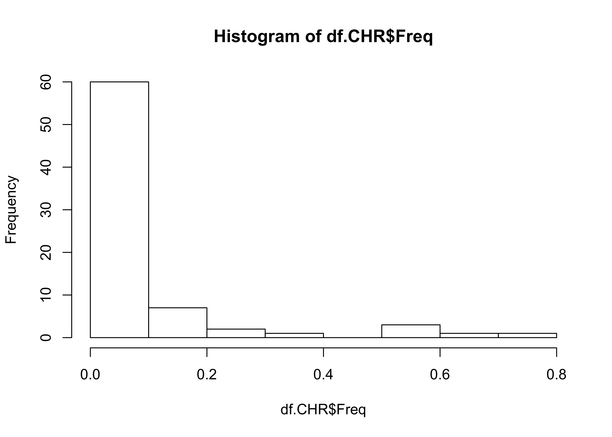

``` r
hist(log(df.SI$Freq)) #Better, but not great
```

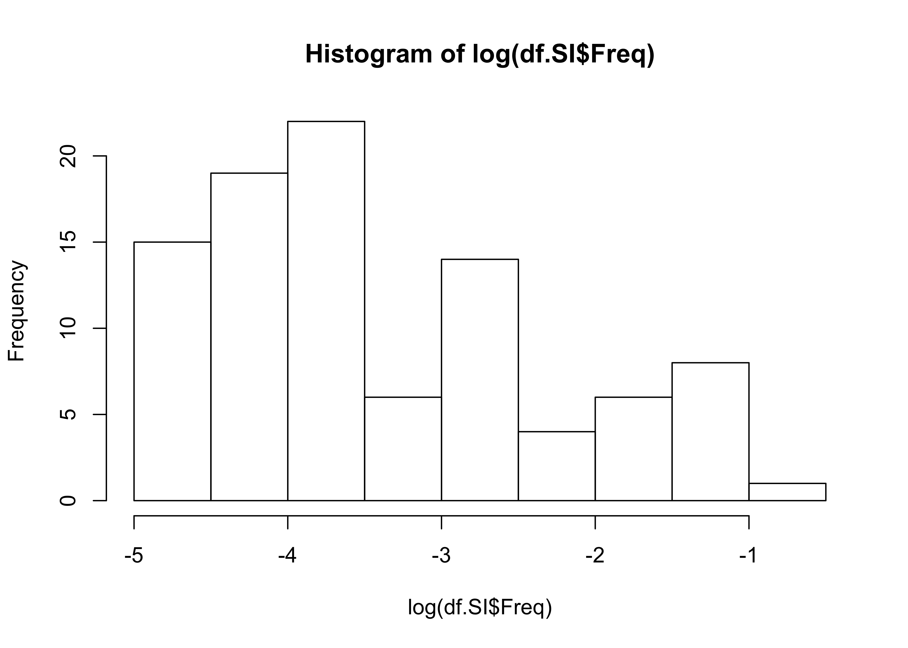

``` r
hist(log(df.CHR$Freq)) #Better, but not great
```


``` r
#Models of genotype frequency with respect to the number of plants sampled:
lmCHR.plants <- lm(Freq ~ CHR_plants_sampled, data=df.CHR) #Sachs and Torres-Martinez model
summary(lmCHR.plants)
```

    ## 
    ## Call:
    ## lm(formula = Freq ~ CHR_plants_sampled, data = df.CHR)
    ## 
    ## Residuals:
    ##      Min       1Q   Median       3Q      Max 
    ## -0.09187 -0.07003 -0.06113 -0.01943  0.65462 
    ## 
    ## Coefficients:
    ##                     Estimate Std. Error t value Pr(>|t|)   
    ## (Intercept)         0.124283   0.040364   3.079  0.00293 **
    ## CHR_plants_sampled -0.002422   0.001995  -1.214  0.22851   
    ## ---
    ## Signif. codes:  0 '***' 0.001 '**' 0.01 '*' 0.05 '.' 0.1 ' ' 1
    ## 
    ## Residual standard error: 0.1499 on 73 degrees of freedom
    ## Multiple R-squared:  0.0198, Adjusted R-squared:  0.006375 
    ## F-statistic: 1.475 on 1 and 73 DF,  p-value: 0.2285

``` r
plot(lmCHR.plants) #Model does not fit data
```


``` r
lmCHR.plants.v2 <-lm(log(Freq) ~ CHR_plants_sampled, data=df.CHR) #Log-transformed
summary(lmCHR.plants.v2) #Marginal significance
```

    ## 
    ## Call:
    ## lm(formula = log(Freq) ~ CHR_plants_sampled, data = df.CHR)
    ## 
    ## Residuals:
    ##     Min      1Q  Median      3Q     Max 
    ## -1.4516 -0.6717 -0.5642  0.7241  3.2425 
    ## 
    ## Coefficients:
    ##                    Estimate Std. Error t value Pr(>|t|)    
    ## (Intercept)        -2.99383    0.33752  -8.870 3.27e-13 ***
    ## CHR_plants_sampled -0.02966    0.01668  -1.778   0.0796 .  
    ## ---
    ## Signif. codes:  0 '***' 0.001 '**' 0.01 '*' 0.05 '.' 0.1 ' ' 1
    ## 
    ## Residual standard error: 1.253 on 73 degrees of freedom
    ## Multiple R-squared:  0.04151,    Adjusted R-squared:  0.02838 
    ## F-statistic: 3.161 on 1 and 73 DF,  p-value: 0.07958

``` r
plot(lmCHR.plants.v2) #Still not good, but better than without transforming the data
```

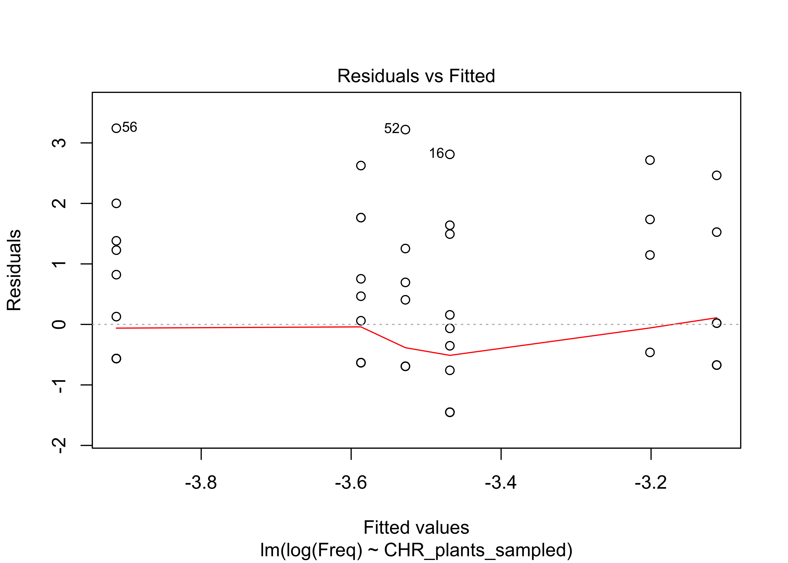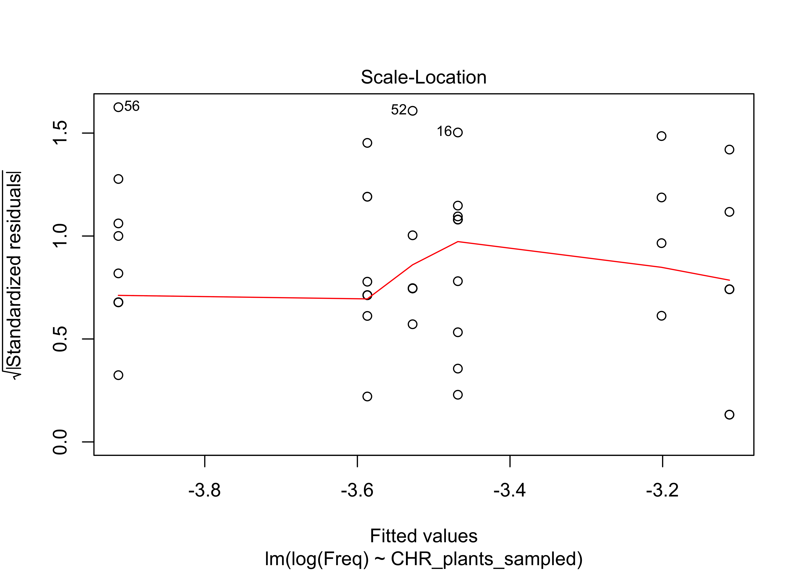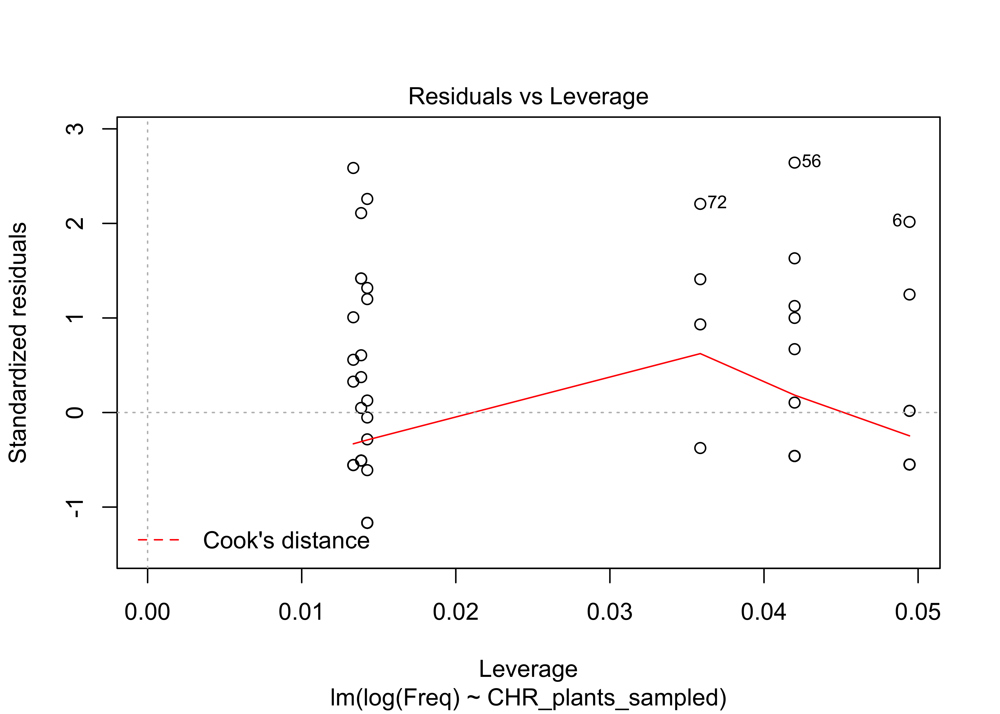

``` r
lmCHR.plants.v3 <-lmer(log(Freq) ~ CHR_plants_sampled+(1|haplolist), data=df.CHR) #Log-transformed and accounting for pseudo-replication
summary(lmCHR.plants.v3)
```

    ## Linear mixed model fit by REML ['lmerMod']
    ## Formula: log(Freq) ~ CHR_plants_sampled + (1 | haplolist)
    ##    Data: df.CHR
    ## 
    ## REML criterion at convergence: 232.6
    ## 
    ## Scaled residuals: 
    ##     Min      1Q  Median      3Q     Max 
    ## -1.4340 -0.3431 -0.2289  0.3173  2.2931 
    ## 
    ## Random effects:
    ##  Groups    Name        Variance Std.Dev.
    ##  haplolist (Intercept) 0.7712   0.8782  
    ##  Residual              0.5573   0.7465  
    ## Number of obs: 75, groups:  haplolist, 57
    ## 
    ## Fixed effects:
    ##                    Estimate Std. Error t value
    ## (Intercept)        -3.01399    0.27543 -10.943
    ## CHR_plants_sampled -0.03991    0.01275  -3.129
    ## 
    ## Correlation of Fixed Effects:
    ##             (Intr)
    ## CHR_plnts_s -0.844

``` r
Anova(lmCHR.plants.v3, type=3)
```

    ## Analysis of Deviance Table (Type III Wald chisquare tests)
    ## 
    ## Response: log(Freq)
    ##                       Chisq Df Pr(>Chisq)    
    ## (Intercept)        119.7477  1  < 2.2e-16 ***
    ## CHR_plants_sampled   9.7938  1   0.001751 ** 
    ## ---
    ## Signif. codes:  0 '***' 0.001 '**' 0.01 '*' 0.05 '.' 0.1 ' ' 1

``` r
plot(lmCHR.plants.v3) 
```


``` r
lmSI.plants <- lm(Freq ~ SI_plants_sampled, data=df.SI) #Sachs and Torres-Martinez model
summary(lmSI.plants)
```

    ## 
    ## Call:
    ## lm(formula = Freq ~ SI_plants_sampled, data = df.SI)
    ## 
    ## Residuals:
    ##       Min        1Q    Median        3Q       Max 
    ## -0.088742 -0.036456 -0.008915  0.007816  0.305290 
    ## 
    ## Coefficients:
    ##                    Estimate Std. Error t value Pr(>|t|)    
    ## (Intercept)        0.134092   0.015387   8.715 1.07e-13 ***
    ## SI_plants_sampled -0.005524   0.001050  -5.258 9.23e-07 ***
    ## ---
    ## Signif. codes:  0 '***' 0.001 '**' 0.01 '*' 0.05 '.' 0.1 ' ' 1
    ## 
    ## Residual standard error: 0.07214 on 93 degrees of freedom
    ## Multiple R-squared:  0.2292, Adjusted R-squared:  0.2209 
    ## F-statistic: 27.65 on 1 and 93 DF,  p-value: 9.235e-07

``` r
plot(lmSI.plants) #Model does not fit data
```

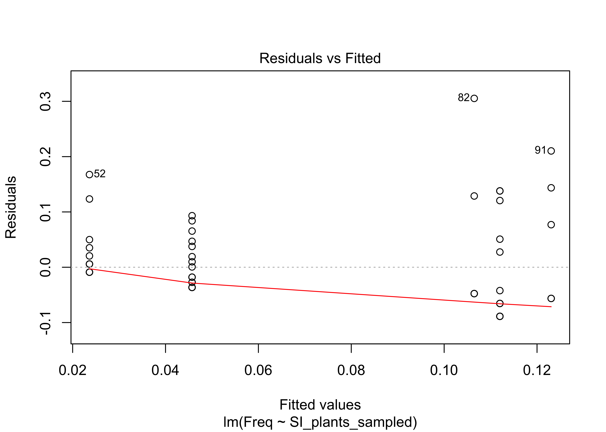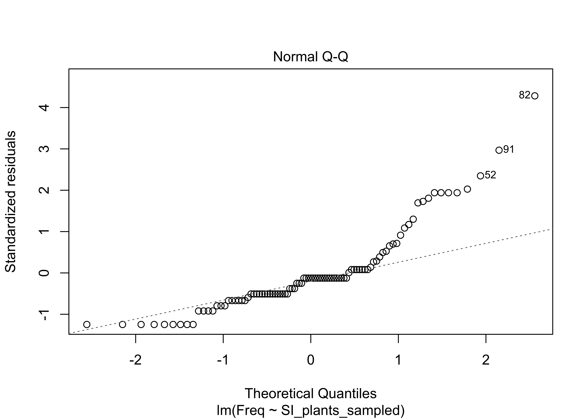

``` r
lmSI.plants.v2 <- lm(log(Freq) ~ SI_plants_sampled, data=df.SI) #Log-transformed
summary(lmSI.plants.v2)
```

    ## 
    ## Call:
    ## lm(formula = log(Freq) ~ SI_plants_sampled, data = df.SI)
    ## 
    ## Residuals:
    ##     Min      1Q  Median      3Q     Max 
    ## -1.1030 -0.7294 -0.2613  0.6246  2.3037 
    ## 
    ## Coefficients:
    ##                   Estimate Std. Error t value Pr(>|t|)    
    ## (Intercept)       -2.33317    0.19125 -12.199  < 2e-16 ***
    ## SI_plants_sampled -0.08125    0.01306  -6.223 1.38e-08 ***
    ## ---
    ## Signif. codes:  0 '***' 0.001 '**' 0.01 '*' 0.05 '.' 0.1 ' ' 1
    ## 
    ## Residual standard error: 0.8967 on 93 degrees of freedom
    ## Multiple R-squared:  0.294,  Adjusted R-squared:  0.2864 
    ## F-statistic: 38.73 on 1 and 93 DF,  p-value: 1.385e-08

``` r
plot(lmSI.plants.v2) #Also better
```

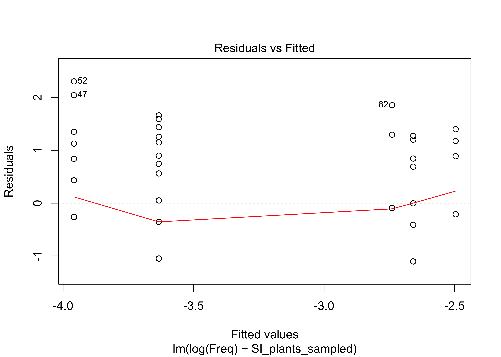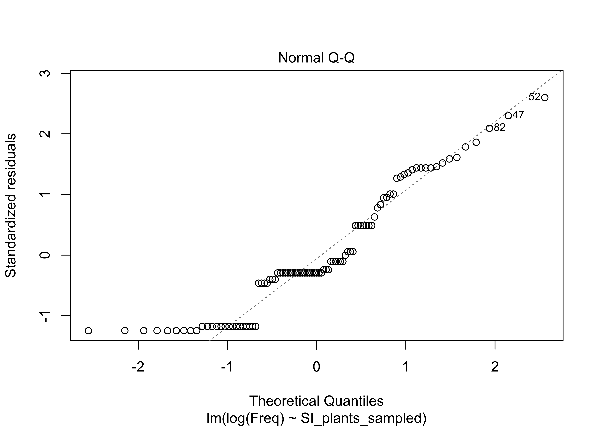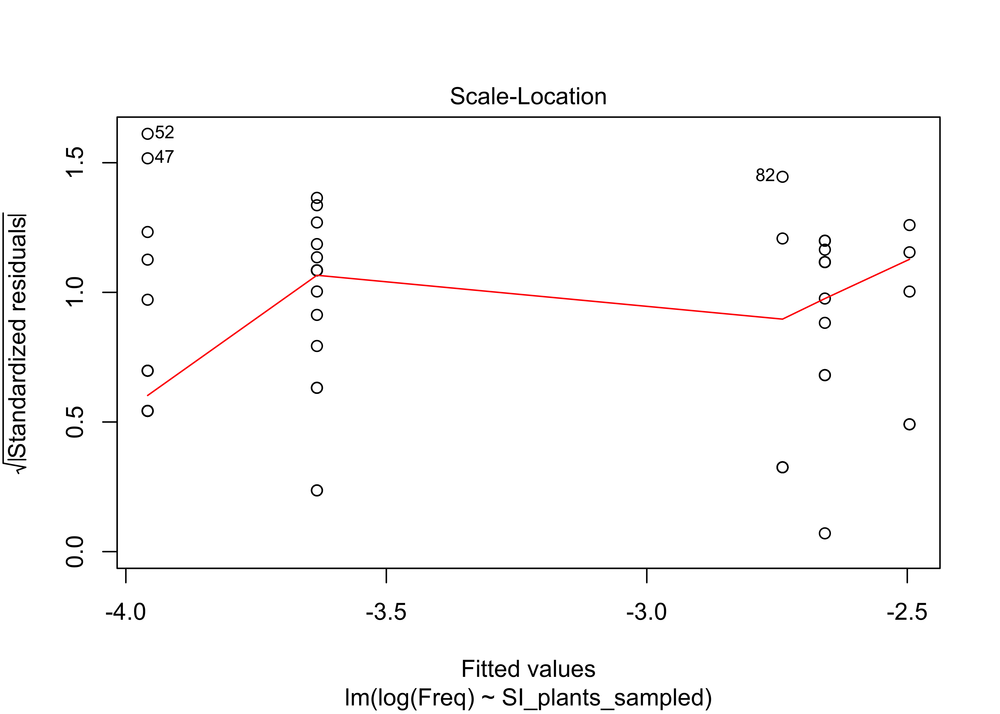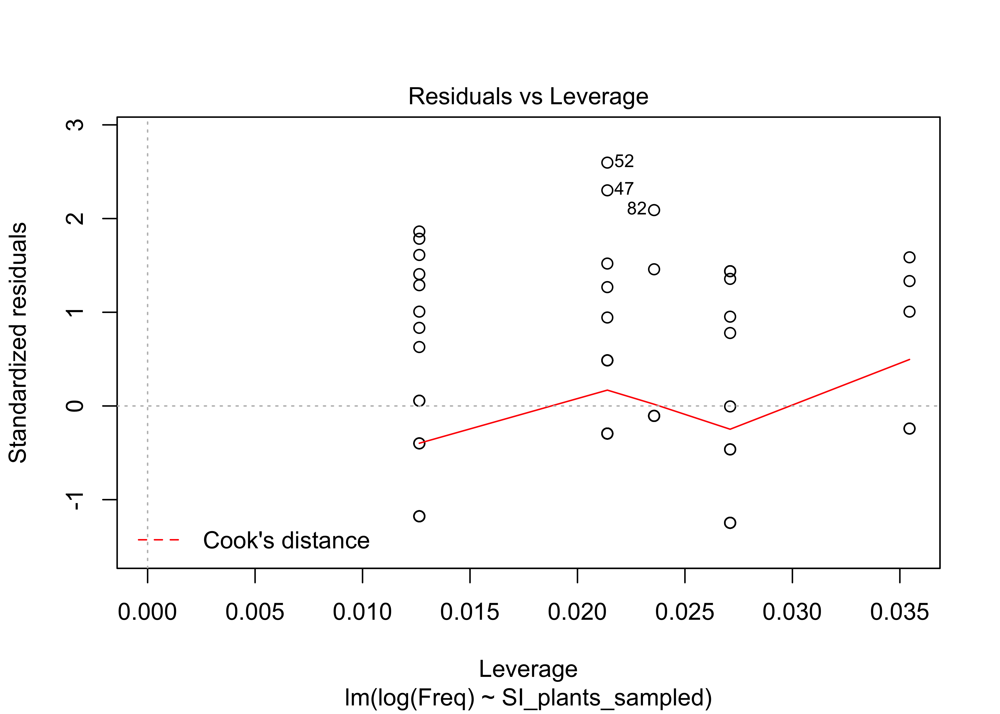

``` r
lmSI.plants.v3 <- lmer(log(Freq) ~ SI_plants_sampled+(1|haplolist), data=df.SI) #Log-transformed and accounting for pseudo-replication
summary(lmSI.plants.v3)
```

    ## Linear mixed model fit by REML ['lmerMod']
    ## Formula: log(Freq) ~ SI_plants_sampled + (1 | haplolist)
    ##    Data: df.SI
    ## 
    ## REML criterion at convergence: 251.7
    ## 
    ## Scaled residuals: 
    ##     Min      1Q  Median      3Q     Max 
    ## -1.6150 -0.8007 -0.1865  0.4355  1.8148 
    ## 
    ## Random effects:
    ##  Groups    Name        Variance Std.Dev.
    ##  haplolist (Intercept) 0.2906   0.5390  
    ##  Residual              0.4877   0.6984  
    ## Number of obs: 95, groups:  haplolist, 84
    ## 
    ## Fixed effects:
    ##                   Estimate Std. Error t value
    ## (Intercept)       -2.37752    0.18733 -12.691
    ## SI_plants_sampled -0.08171    0.01252  -6.527
    ## 
    ## Correlation of Fixed Effects:
    ##             (Intr)
    ## SI_plnts_sm -0.865

``` r
Anova(lmSI.plants.v3)
```

    ## Analysis of Deviance Table (Type II Wald chisquare tests)
    ## 
    ## Response: log(Freq)
    ##                   Chisq Df Pr(>Chisq)    
    ## SI_plants_sampled  42.6  1  6.717e-11 ***
    ## ---
    ## Signif. codes:  0 '***' 0.001 '**' 0.01 '*' 0.05 '.' 0.1 ' ' 1

``` r
plot(lmSI.plants.v3) 
```

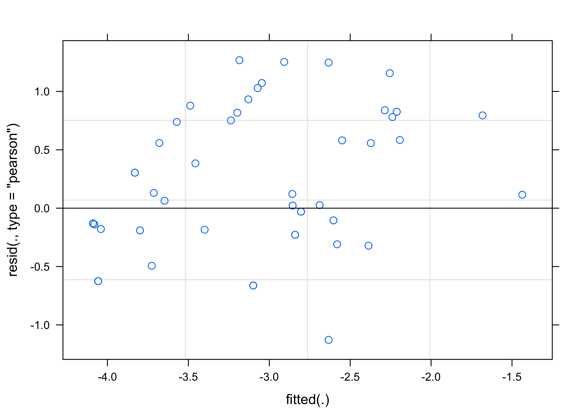

``` r
#Visualize sampling effect on just the CHR and SI haplotypes of strains 155 and 156
#Subset to CHR haplotypes G11_R07 and G03_R01
subset.CHR <- subset(df.CHR, haplolist == "G11_R07" | haplolist == "G03_R01")

p1 <- ggplot(data=subset.CHR, aes(x=CHR_plants_sampled, y=Freq))+geom_point(aes(color=Population))+geom_smooth(method="lm", se=FALSE)+theme_bw()+theme(panel.grid=element_blank())+scale_color_manual(values=c("#B79F00", "#00BA38", "#00BFC4", "#619CFF", "#F564E3"))+ylab("CHR genotype frequency")+xlab("Plants sampled (no.)")+facet_wrap(~haplolist, scales="free")
p1
```

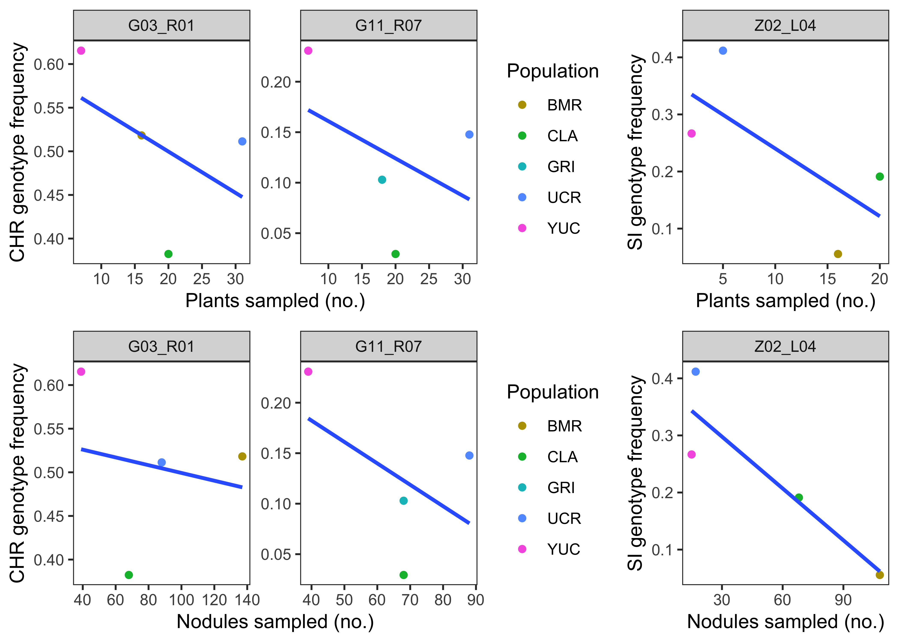

``` r
p2 <- ggplot(data=subset.CHR, aes(x=CHR_nods_sampled, y=Freq))+geom_point(aes(color=Population))+geom_smooth(method="lm", se=FALSE)+theme_bw()+theme(panel.grid=element_blank())+scale_color_manual(values=c("#B79F00", "#00BA38", "#00BFC4", "#619CFF", "#F564E3"))+ylab("CHR genotype frequency")+xlab("Nodules sampled (no.)")+facet_wrap(~haplolist, scales="free")
p2
```


``` r
#Subset to SI haplotype Z02_L04
subset.SI <- subset(df.SI, haplolist == "Z02_L04")
p3 <- ggplot(data=subset.SI, aes(x=SI_plants_sampled, y=Freq))+geom_point(aes(color=Population))+geom_smooth(method="lm", se=FALSE)+theme_bw()+theme(panel.grid=element_blank())+guides(color=FALSE)+scale_color_manual(values=c("#B79F00", "#00BA38", "#619CFF", "#F564E3"))+ylab("SI genotype frequency")+xlab("Plants sampled (no.)")+facet_wrap(~haplolist, scales="free")
p3
```


``` r
p4 <- ggplot(data=subset.SI, aes(x=SI_nods_sampled, y=Freq))+geom_point(aes(color=Population))+geom_smooth(method="lm", se=FALSE)+theme_bw()+theme(panel.grid=element_blank())+scale_color_manual(values=c("#B79F00", "#00BA38", "#619CFF", "#F564E3"))+ylab("SI genotype frequency")+guides(color=FALSE)+ylab("SI genotype frequency")+xlab("Nodules sampled (no.)")+facet_wrap(~haplolist, scales="free")
p4
```


``` r
p5 <- plot_grid(p1, p3, p2, p4, rel_widths = c(2.2, 1))
p5
```

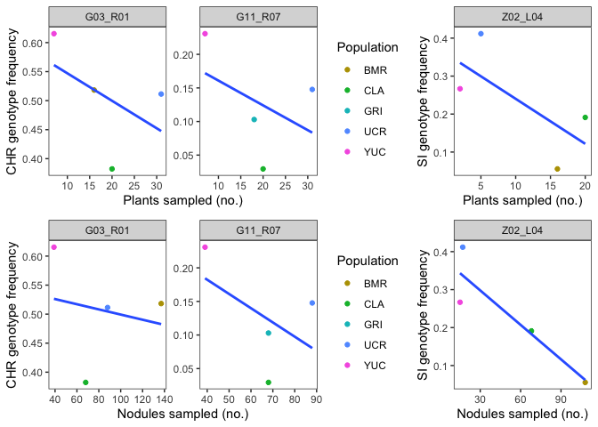
